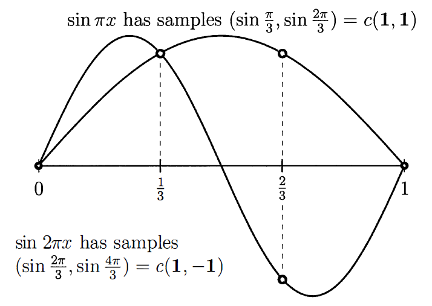

## 시작에 앞서..
> 이 포스팅 시리즈는 대학원 수업 [기초계산수학]의 내용을 바탕으로 정리한 글입니다. Gilbert strang 교수님의 책 "Computational science and engineering[^1]"을 참고하여 작성하였습니다.
{:.prompt-info}

## Eigenvalues and Eigenvectors

이번 장에서는 $ A x = \lambda x $ 형태를 다룬다. 이것은 eigenvector $ x $와 각각에 대응되는 eigenvalue $ \lambda $와 관련된 식이다. $ \text{det}(A - \lambda I) = 0 $ 부터 시작해서 위 식을 풀 수는 있지만.. 행렬이 커질수록 저 방법으로 푸는 것은 아주 고통스러울 것이다. 수치선형대수의 발전으로 eigenvalue를 계산하는 빠르고 안정적인 알고리즘이 등장했으나, 이번 장에서는 좀 특별한 행렬들을 다루기 때문에 수치적으로가 아닌 정확한 $ \lambda $와 $ x $를 구하는 방법을 다를 것이다. 이번 장은 다음의 두 파트로 나뉠 수 있다.

1. Part I. 행렬 $ A $를 diagonalize하는데에 eigenvalue를 적용하여 $ u' = Au $를 푼다. ($ A = S \Lambda S^{-1} $)
2. Part II. $ K_n, T_n, B_n, C_n $ 행렬의 eigenvalues는 전부 $ \lambda = 2 - 2 \cos \theta $이다. ($ K = Q \Lambda Q^T $)

### Part I: $ A x = \lambda x $ and $ A^k x = \lambda^k x $ and Diagonalizing $ A $

거의 모든 벡터는 $ A $와 곱해지면 방향이 바뀐다. **예외적으로 어떤 벡터 $x$는 $ Ax $와 같은 선 상에 있게 된다.** 이 벡터를 eigenvector라고 부르며, 이 eigenvector에 대해, **$ Ax $는 기존 $ x $보다 $ \lambda $배 만큼 늘어난다.**

Eigenvalue $\lambda$는 특별한 벡터 $x$가 늘어나는지(stretched), 줄어드는지(shrunk) 또는 방향이 반전되거나(reversed) 가만히 있는지(left unchanged)를 나타낸다. 예를 들어 $\lambda = 2$(stretching), $\lambda = 0.5$(shrinking), $\lambda = -1$(reversing), $\lambda = 1$(steady state) 등으로 나타낼 수 있다. (자세한건 뒤에서..) 아니면 $\lambda = 0$과 같은 경우도 찾을 수도 있는데, 만약 nullspace가 nonzero vector들을 포함하면, $Ax=0x$가 성립하고, nullspace는 $\lambda=0$에 해당하는 eigenvector들을 포함한다.

우리의 특별한 행렬들 ($K, T, B, C$)에 대해서 우리는 $x$를 먼저 유추하고, $\lambda$를 구할 것이다. (일반 행렬에 대해서는 $\lambda$를 먼저 구한다.) $\lambda$를 $x$와 분리하기 위해 다음으로 식을 바꿔보자:

$$
(A - \lambda I)x = 0
$$

행렬 $A - \lambda I$는 singular해야 한다. (즉, determinant가 0이 되어야 한다.) 우리가 알아야 하는 것은, $A - \lambda I$가 not invertible(가역이 아니여야)해야 $\lambda$가 eigenvalue라는 것이다.

> $\lambda$는 다음 필요충분조건을 만족할 때 $A$의 eigenvalue이다.
> $\text{det}(A - \lambda I) = 0$

이 **특별한 식**은 $x$가 아닌 $\lambda$만을 가지고 있다. $\text{det}(A - \lambda I) = 0$은 n차 다항식이며, 이 다항식은 n개의 근 $\lambda_1, \dots, \lambda_n$을 가진다. 어떤 eigenvalues는 복소수 형태일 수도 있고, 중근의 형태일 수도 있다.

> **Example 1** 다음의 특별한 2x2 행렬 $K=[2 \quad -1; -1 \quad 2]$에 대해서 $K^{100}$을 추정하라.
>
> $$
> K-\lambda I = \begin{bmatrix} 2-\lambda & -1 \\ -1 & 2-\lambda \end{bmatrix}
> $$
>
> 위 식의 determinant를 구하면,
>
> $$
> \text{det}(K - \lambda I) = (2-\lambda)^2 - 1 = \lambda^2 - 4\lambda + 3 = (\lambda - 3)(\lambda - 1)
> $$
>
> 따라서 eigenvalue는 $\lambda_1 = 3, \lambda_2 = 1$임을 구할 수 있다. 이제 $(K-\lambda I)x = 0$를 $\lambda_1$과 $\lambda_2$에 대해서 풀어서 eigenvector를 구하면,
>
> $$
> \lambda_1 = 3 \quad K-3I = \begin{bmatrix} -1 & -1 \\ -1 & -1 \end{bmatrix} \quad x_1 = \begin{bmatrix} 1 \\ -1 \end{bmatrix}
> $$
> 
> $$
> \lambda_2 = 1 \quad K-I = \begin{bmatrix} 1 & -1 \\ -1 & 1 \end{bmatrix} \quad x_2 = \begin{bmatrix} 1 \\ 1 \end{bmatrix}
> $$
>
> 예상했듯, $K-I$와 $K-3I$는 singular하다. 그래서 eigenvector는 우리가 원하는 대로 고를 수 있었는데, 이 경우에는 그냥 보기 쉽게 1과 -1로 구성되도록 구했다.
>
> 이러한 $K$의 eigenvector는 특별하다. 만약 함수 $\sin{\pi x}$와 $\sin{2\pi x}$를 그리면, 두 개의 meshpoint $x = \frac{1}{3}, \frac{2}{3}$에서의 값은 eigenvector의 값과 같을 것이다. (갑자기요?) 함수 $\sin{k\pi x}$가 왜 나왔는지는 곧 알게 된다.
>
> {: w="50%" .normal}
>
> 위 figure에서 오른쪽 그림을 먼저 보면, $\sin{\pi x}$에  $x = \frac{1}{3}, \frac{2}{3}$를 대입했을 때 결과는 $c(1, 1)$이다. ($c$는 상수) 그리고 $\sin{2 \pi x}$에  $x = \frac{1}{3}, \frac{2}{3}$를 대입했을 때는 결과가 $c(1, -1)$이 된다. 위에서 구한 $x_1$과 $x_2$과 같다!
{: .example-box}

> **Example 2** 3x3의 singular 행렬인 $C_3$가 있다:
>
> $$
> C = \begin{bmatrix} 2 & -1 & -1 \\ -1 & 2 & -1 \\ -1 & -1 & 2 \end{bmatrix}, \quad C - \lambda I = \begin{bmatrix} 2-\lambda & -1 & -1 \\ -1 & 2-\lambda & -1 \\ -1 & -1 & 2-\lambda \end{bmatrix}
> $$
>
> $$
> \text{det}(C - \lambda I) = -\lambda^3 + 6\lambda^2 - 9\lambda = -\lambda(\lambda - 3)^2 = 0
> $$
>
> 위 3차 다항식은 3개의 근을 가지는데, $\lambda_1 = 0$(위 행렬은 singular하므로)와 두 개의 중근 $\lambda_2 = \lambda_3 = 3$을 가진다. $x_1 = (1, 1, 1)$은 $C$의 nullspace에 포함되므로, $\lambda_1$에 대한 eigenvector이다. 이제 $\lambda_2$와 $\lambda_3$에 대한 eigenvector를 구해야 한다.
>
> $$
> C - 3I = \begin{bmatrix} -1 & -1 & -1 \\ -1 & -1 & -1 \\ -1 & -1 & -1 \end{bmatrix} \qquad \text{rank}(C - 3I) = 1 \quad (\text{doubly singular})
> $$
>
> $(C - 3I)x=0$을 푸는 것은 결국 $-x_1-x_2-x_3=0$을 푸는 것과 같다. 즉, 해당 평면 위의 모든 벡터는 $\lambda=3$에 대한 eigenvector가 된다. 어떠한 벡터를 골라도 되지만, 앞서 구한 $x_1$과 직교하고, 서로 직교하는 두 벡터를 다음과 같이 구해보자.
>
> $$
> x_2 = \begin{bmatrix} 1 \\ 0 \\ -1 \end{bmatrix}, \quad x_3 = \begin{bmatrix} 1 \\ -2 \\ 1 \end{bmatrix}
> $$
>
> 그런 후 모든 벡터를 정규화하면,
>
> $$
> x_1 = \frac{1}{\sqrt{3}} \begin{bmatrix} 1 \\ 1 \\ 1 \end{bmatrix}, \quad x_2 = \frac{1}{\sqrt{2}} \begin{bmatrix} 1 \\ 0 \\ -1 \end{bmatrix}, \quad x_3 = \frac{1}{\sqrt{6}} \begin{bmatrix} 1 \\ -2 \\ 1 \end{bmatrix}
> $$
>
> 이렇게 하면 모든 eigenvectors는 "orthonormal"(서로 직교하는 unit vector) 하다. 모든 대칭행렬은 서로 직교하는 n개의 eigenvector들을 무조건 가진다.
{: .example-box}

nxn 크기의 행렬에서 $A-\lambda I$를 풀 때 determinant의 다항식은 $(-\lambda)^n$으로 시작한다. (n차 다항식) 그런데 이 n차 다항식의 근은 n이 4보다 클 때 쉽게 푸는 방법이 없다. (5차 다항식부터는 근의 공식이 존재하지 않음을 Galois가 증명했다.) 그렇기 때문에 우리는 eigenvalue를 구하는 새로운 방법을 찾아야 한다.

새로운 방법은 아니지만 도움이 될만한 몇 가지 사실을 소개한다.

1. **Eigenvalue들의 곱은 $A$의 determinant와 같다.** (중근을 가질 경우 중근의 개수만큼 곱해줘야 한다는 것에 주의하자.)
   - $\text{det}(A-\lambda I) = (\lambda_1 - \lambda)(\lambda_2 - \lambda) \cdots (\lambda_ㅜ - \lambda)$ 이므로, 상수항만 보면, $\lambda_1 \lambda_2 \cdots \lambda_n$이다.
   - 상수항만 보기 위해서 $\text{det}(A-\lambda I)$에 $\lambda=0$을 대입하면, $\text{det}(A)$가 된다.
   - 위 두 식이 같아야 하므로, $\text{det}(A) = \lambda_1 \lambda_2 \cdots \lambda_n$이 성립한다.
2. **Eigenvalue들의 합은 $A$의 trace와 같다.** (중근을 가질 경우 중근의 개수만큼 더해줘야 한다는 것에 주의하자.)

이 성질들은 $\text{det}(A - \lambda I)$를 계산하는 고통을 없애주진 않지만, 다항식의 계수 성질을 이용하여 약간의 유용함을 얻을 수 있다. **Example 1**의 경우, trace는 $2+2=4$이고, eigenvalue들의 합은 $3+1=4$로 같음을 알 수 있다.(2번 성질) 그리고 $K$의 determinant는 $3$이고 이는 두 eigenvalue들의 곱 $3 \cdot 1 = 3$과 같다. (1번 성질) **Example 2**에 대해서도 성립하는 것을 확인할 수 있다. (trace는 $2+2+2=0+3+3=6$, determinant는 $0$)

> **Eigenvalue 문제 $Ax=\lambda x$에 대한 3개의 중요한 사실이 있다.**
> 1. 만약 $A$가 triangular하다면, 그 eigenvalue는 대각선 성분이다.
>   - Determinant를 구할 때, 대각선 성분만 곱해주면 되기 때문이다.
> 2. $A^2$의 eigenvalue는 $\lambda^2$이며, $A^{-1}$의 eigenvalue는 $\frac{1}{\lambda}$이다.
>   - $Ax=\lambda x$ 식의 양 변에 $A$를 곱하고, $A^{-1}$을 곱하면 각각 $A^2x=\lambda^2 x$, $\frac{1}{\lambda} x = A^{-1}x$가 된다.
>   - $A^2$과 $A^{-1}$의 eigenvector는 $A$의 eigenvector와 같다.
> 3. $A+B$와 $AB$의 eigenvalue는 $A$와 $B$ 각각의 eigenvalue들로부터 구할 수 없다.
{: .definition-box }

$AB=BA$가 성립하는 특수한 경우에는 $A$와 $B$가 $Ax=\lambda x$, $x=\lambda^* x$ 에 대해서 동일한 eigenvector를 공유한다. 그럴 경우 $(A+B)x = ( \lambda + \lambda^* ) x $가 성립한다. (즉, eigenvalue는 $ \lambda + \lambda^* $이다.) 그리고 $ ABx = \lambda \lambda^* x $가 성립한다. (즉, eigenvalue는 $ \lambda \lambda^* $이다.)

> **Example 3** Markov matrix는 음수가 아닌 원소만을 포함하고, 각 열의 합이 1인 행렬이다. (State transition matrix 라고 나한텐 더 익숙하다.)
>
> $$
> \text{Markov matrix} \quad A = \begin{bmatrix} 0.8 & 0.3 \\ 0.2 & 0.7 \end{bmatrix}
> $$
>
> 위 마르코프 행렬은 $\lambda=1, 0.5$를 가진다. 모든 Markov 행렬은 $\lambda=1$을 반드시 가진다. $A-I$가 singular해지기 떄문인데, $\lambda=1$이라고 하면, $A-\lambda I = A - I$가 된다. 이 행렬은 각 열에서 1씩 빠지게 되는데, 그렇기 때문에 각 열의 원소들의 합은 0이 된다. 이는 $(A - I)x = 0$이 성립한다는 것이고, 그렇기 때문에 $\lambda = 1$이라는 명제가 참이 된다.
> 그러면 다항식의 계수의 성질을 이용한 $\lambda$의 합과 곱을 이용하여, 만약 trace가 $.8+.7=1.5$라면, 다른 eigenvalue는 0.5라는 것을 알 수 있고, A의 determinant는 그 둘의 곱인 0.5라는 것을 알 수 있다. 1과 .5에 대응되는 eigenvector는 각각 $(.6,.4), (-1,1)$이다.
{: .example-box }

### Eigshow

---
## Reference
[^1]: Gilbert Strang, *Computational Science and Engineering*, Wellesley-Cambridge Press, 2007. DOI: [10.1137/1.9780961408817](https://epubs.siam.org/doi/abs/10.1137/1.9780961408817).
