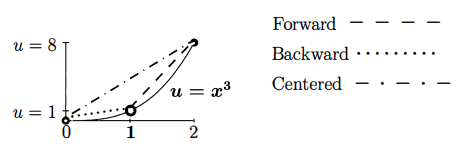
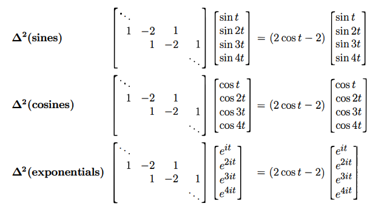
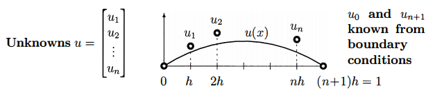

## 시작에 앞서..

> 이 포스팅 시리즈는 대학원 수업 [기초계산수학]의 내용을 바탕으로 정리한 글입니다. Gilbert strang 교수님의 책 "Computational science and engineering[^1]"을 참고하여 작성하였습니다.
{:.prompt-info}

## 1. 연속 방정식을 이산 시스템으로 바꾸는 관점

이 장에서는 다음과 같은 고전적인 연속 경계값 문제를 다룬다.

$$
- \frac{d^2 u}{dx^2} = f(x), \quad u(0) = u(1) = 0
$$

이 식은 공간상에서 두 번 미분된 함수 $ u(x) $ 가 주어진 $ f(x) $ 를 생성하도록 만드는 연속 미분 방정식이다. 이 식을 직접 해석적으로 풀 수도 있지만, 컴퓨터 기반의 수치 계산에서는 이를 **유한 차분 방식(finite difference method)** 으로 변환해 푼다.

그 결과 이 문제는 다음과 같은 **선형 시스템 $ Ku = f $** 으로 바뀐다. 여기서 $ K $ 는 이산 라플라시안(discrete Laplacian) 연산을 수행하는 행렬이며, 경계 조건에 따라 이전 장에서 공부했던 행렬들($ K_n, T_n, B_n $ 등)을을 갖는다.

## 2. 1차 도함수의 차분 근사

연속 함수의 도함수 $ u'(x) $ 를 수치적으로 계산하기 위해 가장 기본적인 접근은 **유한 차분(finite difference)** 이다. 미분의 정의 자체가 극한으로부터 유도되기 때문에, 적절히 작은 $ h $ 를 선택해 다음과 같은 근사식들을 사용할 수 있다.

### 2.1 순방향 차분 (Forward Difference)

$$
\frac{u(x+h) - u(x)}{h}
$$

이 근사는 다음과 같은 테일러 전개로 표현할 수 있다.

$$
= u'(x) + \frac{h}{2} u''(x) + \frac{h^2}{6} u'''(x) + \cdots
$$

즉, 오차 항은 $ O(h) $ 이다. $ h \to 0 $ 이면 정확하지만, 실제 계산에서는 $ h $ 가 유한하므로 오차가 남는다.

### 2.2 역방향 차분 (Backward Difference)

$$
\frac{u(x) - u(x - h)}{h} = u'(x) - \frac{h}{2} u''(x) + \cdots
$$

순방향과 마찬가지로 1차 정확도 $ O(h) $ 를 갖는다.

### 2.3 중앙 차분 (Centered Difference)

$$
\frac{u(x + h) - u(x - h)}{2h}
$$

이 방식은 양쪽으로부터 값을 취하므로 보다 균형 잡힌 근사다. 테일러 전개하면:

$$
= u'(x) + \frac{h^2}{6} u'''(x) + \cdots
$$

즉, 오차가 $ O(h^2) $ 이며, 앞의 두 방법보다 정확도가 더 높다.

_Fig 1.1 - 도함수의 세 가지 유한 차분 근사 방식_

## 3. 2차 도함수의 중심 차분 근사

2계 미분인 $ u\'\'(x) $ 도 마찬가지로 유한 차분으로 근사할 수 있다.  
중앙 차분 방식은 다음과 같다.

$$
\frac{u(x+h) - 2u(x) + u(x-h)}{h^2}
$$

이 식은 정확도 $ O(h^2) $ 를 가진다. 이는 $ u(x) = x^2 $ 같은 2차 다항식에 대해 정확하게 일치한다. 차분 연산을 벡터에 적용하면, 이를 행렬로 나타낼 수 있다. $ n $ 개의 내부 격자점이 있을 때, 해당 차분 행렬은 다음과 같은 구조를 갖는다:

$$
K_n =
\begin{bmatrix}
2 & -1 & 0 & \cdots & 0 \\
-1 & 2 & -1 & \cdots & 0 \\
0 & -1 & 2 & \cdots & 0 \\
\vdots & \vdots & \vdots & \ddots & -1 \\
0 & 0 & 0 & -1 & 2
\end{bmatrix}
$$

이건?! 맞다. 이전 장에서 배웠던 $K$ 행렬이다. 이 행렬은 **이산 라플라시안(discrete Laplacian)** 을 나타내며, 2차 미분을 수행하는 행렬이다.

## 4. 다양한 입력 벡터에 대한 차분 작용

차분 행렬이 어떤 연산을 수행하는지를 확인하기 위해, 입력 벡터 $ u $ 를 다양한 형태로 설정하고 $ Ku $ 를 계산할 수 있다.

- **상수 벡터** $ u = [1, 1, ..., 1]^T $  
  → $ Ku = 0 $  
  → 상수 함수의 도함수는 0

- **선형 벡터** $ u_i = i $  
  → $ Ku = 0 $  
  → 1차 함수의 2계 미분은 0

- **2차 벡터** $ u_i = i^2 $  
  → $ Ku = \text{상수 벡터} $  
  → 2차 함수는 2계 미분 시 상수

- **램프 벡터** (ReLU라고 생각해도 될듯)  
  → $ Ku $ 는 특정 지점에서 급격히 튀는 디랙 델타 ($ \delta(x - \alpha) $) 형태

- **사인, 코사인 또는 복소 지수 함수**  
  → $ Ku = \lambda u $, 즉 **고유값 문제**

이 결과는 차분 행렬이 **고유벡터(사인, 복소지수)** 에 대해 스케일만 바꾸는 작용을 한다는 것을 보여준다.

## 5. 주기 함수 입력에 대한 고유값 계산

입력 벡터로 주기 함수를 취했을 때, $ Ku = \lambda u $ 의 형태로 결과가 나온다. 이때 고유값은 다음과 같이 주어진다:

$$
\lambda(t) = 2\cos(t) - 2
$$

이 결과는 이산 푸리에 변환(DFT)에서 등장하는 **푸리에 고유값 구조**와 일치한다.

_Fig 1.2 - sin, cos, exp 함수 입력에 대한 고유값 계산 결과_

## 6. 미분 방정식의 이산화: 행렬 방정식 $ Ku = f $

연속 문제

$$
- \frac{d^2 u}{dx^2} = f(x), \quad u(0) = u(1) = 0
$$

를 $ n $ 개의 내부 격자점으로 이산화하면, 해의 근사값을 담은 벡터 $ u = [u_1, u_2, \dots, u_n]^T $ 와 함께 다음과 같은 행렬 방정식으로 바뀐다.

$$
\frac{1}{h^2} K_n u = f
$$

여기서 $ h = \frac{1}{n+1} $ 는 격자 간격이며, $ K_n $ 은 앞서 설명한 삼중 대각 행렬이다. 우변 $ f $ 역시 $ f_1, f_2, \dots, f_n $ 값으로 구성된 벡터다.

이 시스템은 선형 방정식이며, 수치적으로 직접 풀 수 있다. 중요한 점은 이 행렬이 **희소(sparse)** 하고 **대칭(symmetric)** 이며, **양의 정부호(positive definite)** 라는 점이다.

_Fig 1.3 - $ u = [u_1, u_2, \dots, u_n]^T $ 해의 근사_

## 7. 경계 조건이 행렬을 결정한다

경계 조건은 단지 수식의 추가 요소가 아니라, **해를 정의하는 데 필수적인 정보**다. 수치적으로는 경계 조건이 차분 행렬의 구조를 변경한다.

- 고정–고정: $ K_n $ 사용  
- 자유–고정: $ T_n $ 사용  
- 자유–자유: $ B_n $ 사용 (마지막 행도 변경됨)

이는 곧, 같은 미분 방정식이라도 어떤 경계 조건을 적용하는지에 따라 해의 구조와 수치적 안정성이 크게 달라진다는 것을 의미한다.

## 8. 중심 차분을 사용한 경계 조건 근사의 정확도 향상

자유 경계 조건 $ u'(0) = 0 $ 을 $ \frac{u_1 - u_0}{h} = 0 $ 로 근사하면 1차 정확도를 갖는다. 그러나 다음과 같이 **중심 차분(centered difference)** 를 사용하면 더 높은 정확도를 얻을 수 있다.

$$
\frac{u_1 - u_{-1}}{2h} = 0 \Rightarrow u_{-1} = u_1
$$

이 식을 이용하면, 다음과 같은 수정이 가능하다:

$$
u_0 - u_1 = \frac{1}{2} h^2 f(0)
$$

이는 정확도 $ O(h^2) $ 를 가지며, 전체 해의 품질을 향상시킨다. 경계 조건은 단순히 한 줄의 수식이 아니라, 전체 문제의 정확도에 본질적인 영향을 미친다.

## 9. 결론

- 연속적인 2계 미분 방정식은 유한 차분을 통해 이산화될 수 있으며, 이는 희소하고 대칭적인 행렬 방정식으로 표현된다.
- 중심 차분은 높은 정확도를 제공하고, 사인·지수 함수 등은 이산 라플라시안 행렬의 고유벡터가 된다.
- 경계 조건은 차분 행렬의 형태를 결정하며, 해의 존재성과 유일성, 그리고 수치적 정확도에 직접적인 영향을 미친다.
- 특히 경계에서의 차분 방법(일방향 vs 중심 차분)은 전체 해의 정확도를 좌우한다. 이를 정교하게 처리하는 것이 고정밀 수치 해석의 핵심이다.

## Reference

[^1]: Gilbert Strang, *Computational Science and Engineering*, Wellesley-Cambridge Press, 2007. DOI: [10.1137/1.9780961408817](https://epubs.siam.org/doi/abs/10.1137/1.9780961408817).
