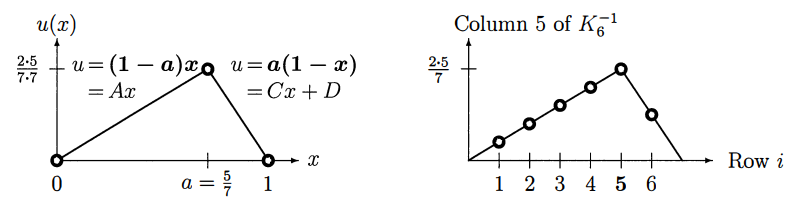

## 시작에 앞서..

> 이 포스팅 시리즈는 대학원 수업 [기초계산수학]의 내용을 바탕으로 정리한 글입니다. Gilbert strang 교수님의 책 "Computational science and engineering[^1]"을 참고하여 작성하였습니다.
{:.prompt-info}

## 1. Inverses and Delta Functions

이번 장에서는 행렬 방정식 $K u = f$와 미분 방정식 $-u'' = f(x)$ 사이의 대응 관계를 다룬다. 특히, 특수한 형태의 벡터 $f$와 함수 $f(x)$로 구성된 경우의 비교가 흥미로웠다.

- 행렬 방정식에서는 $f$를 단위 행렬의 특정 열 $e_j$로 선택한다.
- 미분 방정식에서는 $f(x)$를 특정 지점 $a$에 집중된 하중, 즉 델타 함수 $\delta(x - a)$로 선택한다.

델타 함수 $\delta(x - a)$는 $x=a$에서만 0이 아니며 무한히 뾰족하고 얇은 "점 하중(point load)" 또는 "충격(impulse)"으로 볼 수 있다.  
이때의 해를 **그린 함수(Green's function)**라 부르며, 임의의 하중에 대한 해를 구하는 데 사용된다.

### 1.1 델타 함수와 행렬 역행렬의 관계

행렬 방정식에서 우변을 $e_j$로 선택하면, 해는 행렬 $K$의 역행렬 $K^{-1}$의 $j$번째 열과 동일해진다.

이러한 대응 관계는 아래와 같다.

- 연속 문제의 그린 함수 $u(x,a)$
- 이산 문제의 역행렬 $K^{-1}$의 성분 $(K^{-1})_{ij}$

이 둘은 정확히 대응된다.

_Fig 1 - 중간점 하중 $ \delta(x-\frac{1}{2}) $에 대응되는 연속 문제의 해와 이산 문제의 역행렬 열의 비교_

## 2. Point Load 해의 예제

다음 예시로 미분방정식의 Point Load 문제를 해결한다.

### 2.1: 중심에서의 Point Load (고정-고정 및 자유-고정 조건)

다음 미분방정식과 경계조건을 고려하자.

$$
-u''(x) = \delta\left(x - \frac{1}{2}\right)
$$

- 고정-고정 조건: $u(0) = u(1) = 0$
- 자유-고정 조건: $u'(0) = 0, u(1) = 0$

해 $u(x)$는 하중 지점에서 기울기가 1만큼 급격히 떨어지는 직선 함수(램프 함수) 형태이다.

적분을 통해 기울기 변화 확인:
$$
\int_{\text{left}}^{\text{right}} -u'' dx = \int_{\text{left}}^{\text{right}} \delta\left(x - \frac{1}{2}\right) dx
$$

이는 $u'$가 $x=\frac{1}{2}$에서 1만큼 감소함을 의미한다.

- 고정-고정: 기울기가 $\frac{1}{2}$에서 $\frac{1}{2}$ → $-\frac{1}{2}$
- 자유-고정: 기울기가 $0$에서 → $-1$

## 3. Point Load 이동에 따른 해의 일반적 표현

하중을 임의 위치 $x=a$로 옮기면, 해는 다음 조건들을 만족하는 직선 함수 형태를 가진다.

경계조건과 Point Load 조건:

- $u$ 연속성 (Point Load에서 불연속이 없어야 함)
- 기울기 $u'$는 $x=a$에서 정확히 1만큼 떨어짐.

고정-고정 경계조건에서 일반적인 해는 다음과 같다.

$$
u(x) = 
\begin{cases}
(1 - a)x, & 0 \leq x \leq a \\
(1 - x)a, & a \leq x \leq 1
\end{cases}
$$

_Fig 2 - 임의 지점 하중에 대한 해 $u(x)$의 램프 함수 형태와 행렬 역행렬의 열과의 비교_

## 4. 델타 함수와 그린 함수

델타 함수 $\delta(x-a)$는 다음 성질을 가진다:

- $\delta(x-a)$는 $x=a$에서만 0이 아닌 "무한히 높은" 점 하중
- $\delta(x)$의 적분은 Step Function $S(x)$
- $S(x)$의 적분은 Ramp Function $R(x)$, 즉 $\delta(x) = R''(x)$

_Fig 3 - 델타함수 $\delta(x)$, 계단함수 $S(x)$, 램프함수 $R(x)$ 사이의 관계_

다시 하중이 $x=a$로 이동하면, 미분방정식의 일반 해는 다음과 같다.

$$
-u''(x)=\delta(x-a), \quad u(x)=-R(x-a)+Cx+D
$$

경계 조건에 따라 상수 $C, D$가 정해진다.

- 고정-고정 조건 (fixed-fixed):
$$
u(x)=
\begin{cases}
(1-a)x & x \leq a \\
(1-x)a & x \geq a
\end{cases}
$$

- 자유-고정 조건 (free-fixed):
$$
u(x)=
\begin{cases}
1-a & x \leq a \\
1-x & x \geq a
\end{cases}
$$

이러한 형태는 행렬 방정식의 역행렬의 형태와 정확히 일치한다.

---

## 5. 자유-자유 경계 조건 (Free-Free Boundary Conditions)

양 끝점이 모두 자유(free-free)인 경우, 경계 조건은 다음과 같다.

$$
u'(0)=0, \quad u'(1)=0
$$

이 경우, 단일 델타함수 하중 $\delta(x-a)$로는 문제를 해결할 수 없다.  
램프 함수가 양쪽에서 모두 기울기 0을 만족할 수 없기 때문이다.

그러나 다음과 같이 하중의 총합이 0이면 해가 존재할 수 있다.

$$
f(x)=\delta\left(x-\frac{1}{4}\right)-\delta\left(x-\frac{3}{4}\right)
$$

이 경우 문제는 singular하며, 해가 무수히 많다. 임의의 상수를 더해도 경계조건에 영향을 주지 않기 때문이다.

## 6. 이산 벡터의 점하중, 계단 및 램프 함수

차분 방정식(discrete equation)의 경우, 델타 함수는 하나의 성분만 1이고 나머지는 0인 벡터 형태로 나타난다.

- **델타 벡터**: $\delta = (\dots,0,0,1,0,0,\dots)$ (중심 성분만 1)
- **계단 벡터** $S$: 델타 벡터의 누적 합
- **램프 벡터** $R$: 계단 벡터의 누적 합

이러한 벡터들은 연속 문제의 $\delta(x)$, $S(x)$, $R(x)$와 대응된다.

_Fig 4 - 델타 벡터, 계단 벡터, 램프 벡터의 관계 및 이들의 차분 관계_

## 7. 이산 방정식과 역행렬의 의미

행렬 방정식은 다음과 같이 표현된다:

- 고정-고정 경계 조건의 경우:
$$
-u_{i-1} + 2u_i - u_{i+1} = \delta_{ij}, \quad u_0=0, u_{n+1}=0
$$

위 식은 행렬 형태로 간단히 표현할 수 있다:

$$
K_n u = e_j
$$

- 여기서 $e_j$는 단위 벡터(Identity matrix의 열)이다.
- 위 식의 해 $u$는 $K_n^{-1}$의 $j$번째 열이다. 즉, 역행렬 $K_n^{-1}$은 이산화된 그린 함수에 해당한다.

## 8. 일반적인 해의 형태 (고정-고정 조건)

이산 방정식의 일반적인 해 형태는 다음과 같다:

하중 위치 $j$를 기준으로, 해는 램프 형태로 선형적으로 증가한 뒤 감소한다.

$$
u_i=
\begin{cases}
\dfrac{i(n+1-j)}{n+1}, & i \leq j \\[6pt]
\dfrac{j(n+1-i)}{n+1}, & i \geq j
\end{cases}
$$

## 9. 자유-고정 경계 조건의 이산 방정식

자유-고정 경계 조건에서는 다음 방정식을 푼다.

$$
-u_{i-1}+2u_i-u_{i+1}=\delta_{ij}, \quad u_1 - u_0=0, u_{n+1}=0
$$

이 경우의 해는 상수값으로 시작하여 하중 위치 이후로는 감소하는 형태를 가진다.

해의 형태는 다음과 같다:

$$
u_i=
\begin{cases}
n+1-j, & i \leq j \\[6pt]
n+1-i, & i \geq j
\end{cases}
$$

이것은 행렬 $T^{-1}$의 열 벡터에 대응된다.

## 10. 그린 함수와 역행렬 (연속과 이산의 대응)

점 하중에 대한 해를 알면, 임의의 하중에 대한 해를 얻을 수 있다.

- 행렬 방정식의 경우:
$$
u = K^{-1}f
$$

- 연속 방정식의 경우(적분 형태):
$$
-u''(x)=f(x)=\int_0^1 f(a)\delta(x-a)da, \quad u(x)=\int_0^1 f(a)u(x,a)da
$$

여기서 $u(x,a)$가 연속 문제의 Green's function에 해당한다.

## 11. 연속과 이산 문제의 정확한 대응 관계

연속 문제의 Green's function $u(x,a)$를 이산화하여 점 $x=\frac{i}{n+1}$, $a=\frac{j}{n+1}$에서 값을 얻으면, 정확히 이산 문제의 역행렬 $K_n^{-1}$의 성분과 대응된다.

- 정확한 대응은 격자 간격 $h=\frac{1}{n+1}$으로 스케일링한 경우에 성립한다.

---

## Reference

[^1]: Gilbert Strang, *Computational Science and Engineering*, Wellesley-Cambridge Press, 2007. DOI: [10.1137/1.9780961408817](https://epubs.siam.org/doi/abs/10.1137/1.9780961408817).
