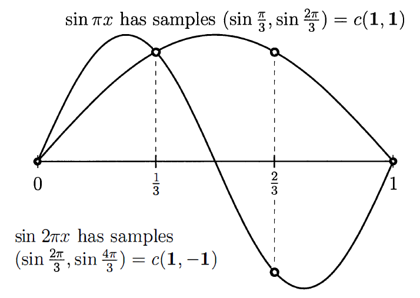

## 시작에 앞서..
> 이 포스팅 시리즈는 대학원 수업 [기초계산수학]의 내용을 바탕으로 정리한 글입니다. Gilbert strang 교수님의 책 "Computational science and engineering[^1]"을 참고하여 작성하였습니다.
{:.prompt-info}

---

## Eigenvalues and Eigenvectors

이번 장에서는 $ A x = \lambda x $ 형태를 다룬다. 이것은 eigenvector $ x $와 각각에 대응되는 eigenvalue $ \lambda $와 관련된 식이다. $ \text{det}(A - \lambda I) = 0 $ 부터 시작해서 위 식을 풀 수는 있지만.. 행렬이 커질수록 저 방법으로 푸는 것은 아주 고통스러울 것이다. 수치선형대수의 발전으로 eigenvalue를 계산하는 빠르고 안정적인 알고리즘이 등장했으나, 이번 장에서는 좀 특별한 행렬들을 다루기 때문에 수치적으로가 아닌 정확한 $ \lambda $와 $ x $를 구하는 방법을 다를 것이다. 이번 장은 다음의 두 파트로 나뉠 수 있다.

1. Part I. 행렬 $ A $를 diagonalize하는데에 eigenvalue를 적용하여 $ u' = Au $를 푼다. ($ A = S \Lambda S^{-1} $)
2. Part II. $ K_n, T_n, B_n, C_n $ 행렬의 eigenvalues는 전부 $ \lambda = 2 - 2 \cos \theta $이다. ($ K = Q \Lambda Q^T $)

---

### Part I: $ A x = \lambda x $ and $ A^k x = \lambda^k x $ and Diagonalizing $ A $

거의 모든 벡터는 $ A $와 곱해지면 방향이 바뀐다. **예외적으로 어떤 벡터 $x$는 $ Ax $와 같은 선 상에 있게 된다.** 이 벡터를 eigenvector라고 부르며, 이 eigenvector에 대해, **$ Ax $는 기존 $ x $보다 $ \lambda $배 만큼 늘어난다.**

Eigenvalue $\lambda$는 특별한 벡터 $x$가 늘어나는지(stretched), 줄어드는지(shrunk) 또는 방향이 반전되거나(reversed) 가만히 있는지(left unchanged)를 나타낸다. 예를 들어 $\lambda = 2$(stretching), $\lambda = 0.5$(shrinking), $\lambda = -1$(reversing), $\lambda = 1$(steady state) 등으로 나타낼 수 있다. (자세한건 뒤에서..) 아니면 $\lambda = 0$과 같은 경우도 찾을 수도 있는데, 만약 nullspace가 nonzero vector들을 포함하면, $Ax=0x$가 성립하고, nullspace는 $\lambda=0$에 해당하는 eigenvector들을 포함한다.

우리의 특별한 행렬들 ($K, T, B, C$)에 대해서 우리는 $x$를 먼저 유추하고, $\lambda$를 구할 것이다. (일반 행렬에 대해서는 $\lambda$를 먼저 구한다.) $\lambda$를 $x$와 분리하기 위해 다음으로 식을 바꿔보자:

$$
(A - \lambda I)x = 0
$$

행렬 $A - \lambda I$는 singular해야 한다. (즉, determinant가 0이 되어야 한다.) 우리가 알아야 하는 것은, $A - \lambda I$가 not invertible(가역이 아니여야)해야 $\lambda$가 eigenvalue라는 것이다.

> $\lambda$는 다음 필요충분조건을 만족할 때 $A$의 eigenvalue이다.
> $\text{det}(A - \lambda I) = 0$

이 **특별한 식**은 $x$가 아닌 $\lambda$만을 가지고 있다. $\text{det}(A - \lambda I) = 0$은 n차 다항식이며, 이 다항식은 n개의 근 $\lambda_1, \dots, \lambda_n$을 가진다. 어떤 eigenvalues는 복소수 형태일 수도 있고, 중근의 형태일 수도 있다.

> **Example 1** 다음의 특별한 2x2 행렬 $K=[2 \quad -1; -1 \quad 2]$에 대해서 $K^{100}$을 추정하라.
>
> $$
> K-\lambda I = \begin{bmatrix} 2-\lambda & -1 \\ -1 & 2-\lambda \end{bmatrix}
> $$
>
> 위 식의 determinant를 구하면,
>
> $$
> \text{det}(K - \lambda I) = (2-\lambda)^2 - 1 = \lambda^2 - 4\lambda + 3 = (\lambda - 3)(\lambda - 1)
> $$
>
> 따라서 eigenvalue는 $\lambda_1 = 3, \lambda_2 = 1$임을 구할 수 있다. 이제 $(K-\lambda I)x = 0$를 $\lambda_1$과 $\lambda_2$에 대해서 풀어서 eigenvector를 구하면,
>
> $$
> \lambda_1 = 3 \quad K-3I = \begin{bmatrix} -1 & -1 \\ -1 & -1 \end{bmatrix} \quad x_1 = \begin{bmatrix} 1 \\ -1 \end{bmatrix}
> $$
> 
> $$
> \lambda_2 = 1 \quad K-I = \begin{bmatrix} 1 & -1 \\ -1 & 1 \end{bmatrix} \quad x_2 = \begin{bmatrix} 1 \\ 1 \end{bmatrix}
> $$
>
> 예상했듯, $K-I$와 $K-3I$는 singular하다. 그래서 eigenvector는 우리가 원하는 대로 고를 수 있었는데, 이 경우에는 그냥 보기 쉽게 1과 -1로 구성되도록 구했다.
>
> 이러한 $K$의 eigenvector는 특별하다. 만약 함수 $\sin{\pi x}$와 $\sin{2\pi x}$를 그리면, 두 개의 meshpoint $x = \frac{1}{3}, \frac{2}{3}$에서의 값은 eigenvector의 값과 같을 것이다. (갑자기요?) 함수 $\sin{k\pi x}$가 왜 나왔는지는 곧 알게 된다.
>
> {: w="50%" .normal}
>
> 위 figure에서 오른쪽 그림을 먼저 보면, $\sin{\pi x}$에  $x = \frac{1}{3}, \frac{2}{3}$를 대입했을 때 결과는 $c(1, 1)$이다. ($c$는 상수) 그리고 $\sin{2 \pi x}$에  $x = \frac{1}{3}, \frac{2}{3}$를 대입했을 때는 결과가 $c(1, -1)$이 된다. 위에서 구한 $x_1$과 $x_2$과 같다!
{: .example-box}

> **Example 2** 3x3의 singular 행렬인 $C_3$가 있다:
>
> $$
> C = \begin{bmatrix} 2 & -1 & -1 \\ -1 & 2 & -1 \\ -1 & -1 & 2 \end{bmatrix}, \quad C - \lambda I = \begin{bmatrix} 2-\lambda & -1 & -1 \\ -1 & 2-\lambda & -1 \\ -1 & -1 & 2-\lambda \end{bmatrix}
> $$
>
> $$
> \text{det}(C - \lambda I) = -\lambda^3 + 6\lambda^2 - 9\lambda = -\lambda(\lambda - 3)^2 = 0
> $$
>
> 위 3차 다항식은 3개의 근을 가지는데, $\lambda_1 = 0$(위 행렬은 singular하므로)와 두 개의 중근 $\lambda_2 = \lambda_3 = 3$을 가진다. $x_1 = (1, 1, 1)$은 $C$의 nullspace에 포함되므로, $\lambda_1$에 대한 eigenvector이다. 이제 $\lambda_2$와 $\lambda_3$에 대한 eigenvector를 구해야 한다.
>
> $$
> C - 3I = \begin{bmatrix} -1 & -1 & -1 \\ -1 & -1 & -1 \\ -1 & -1 & -1 \end{bmatrix} \qquad \text{rank}(C - 3I) = 1 \quad (\text{doubly singular})
> $$
>
> $(C - 3I)x=0$을 푸는 것은 결국 $-x_1-x_2-x_3=0$을 푸는 것과 같다. 즉, 해당 평면 위의 모든 벡터는 $\lambda=3$에 대한 eigenvector가 된다. 어떠한 벡터를 골라도 되지만, 앞서 구한 $x_1$과 직교하고, 서로 직교하는 두 벡터를 다음과 같이 구해보자.
>
> $$
> x_2 = \begin{bmatrix} 1 \\ 0 \\ -1 \end{bmatrix}, \quad x_3 = \begin{bmatrix} 1 \\ -2 \\ 1 \end{bmatrix}
> $$
>
> 그런 후 모든 벡터를 정규화하면,
>
> $$
> x_1 = \frac{1}{\sqrt{3}} \begin{bmatrix} 1 \\ 1 \\ 1 \end{bmatrix}, \quad x_2 = \frac{1}{\sqrt{2}} \begin{bmatrix} 1 \\ 0 \\ -1 \end{bmatrix}, \quad x_3 = \frac{1}{\sqrt{6}} \begin{bmatrix} 1 \\ -2 \\ 1 \end{bmatrix}
> $$
>
> 이렇게 하면 모든 eigenvectors는 "orthonormal"(서로 직교하는 unit vector) 하다. 모든 대칭행렬은 서로 직교하는 n개의 eigenvector들을 무조건 가진다.
{: .example-box}

nxn 크기의 행렬에서 $A-\lambda I$를 풀 때 determinant의 다항식은 $(-\lambda)^n$으로 시작한다. (n차 다항식) 그런데 이 n차 다항식의 근은 n이 4보다 클 때 쉽게 푸는 방법이 없다. (5차 다항식부터는 근의 공식이 존재하지 않음을 Galois가 증명했다.) 그렇기 때문에 우리는 eigenvalue를 구하는 새로운 방법을 찾아야 한다.

새로운 방법은 아니지만 도움이 될만한 몇 가지 사실을 소개한다.

1. **Eigenvalue들의 곱은 $A$의 determinant와 같다.** (중근을 가질 경우 중근의 개수만큼 곱해줘야 한다는 것에 주의하자.)
   - $\text{det}(A-\lambda I) = (\lambda_1 - \lambda)(\lambda_2 - \lambda) \cdots (\lambda_ㅜ - \lambda)$ 이므로, 상수항만 보면, $\lambda_1 \lambda_2 \cdots \lambda_n$이다.
   - 상수항만 보기 위해서 $\text{det}(A-\lambda I)$에 $\lambda=0$을 대입하면, $\text{det}(A)$가 된다.
   - 위 두 식이 같아야 하므로, $\text{det}(A) = \lambda_1 \lambda_2 \cdots \lambda_n$이 성립한다.
2. **Eigenvalue들의 합은 $A$의 trace와 같다.** (중근을 가질 경우 중근의 개수만큼 더해줘야 한다는 것에 주의하자.)

이 성질들은 $\text{det}(A - \lambda I)$를 계산하는 고통을 없애주진 않지만, 다항식의 계수 성질을 이용하여 약간의 유용함을 얻을 수 있다. **Example 1**의 경우, trace는 $2+2=4$이고, eigenvalue들의 합은 $3+1=4$로 같음을 알 수 있다.(2번 성질) 그리고 $K$의 determinant는 $3$이고 이는 두 eigenvalue들의 곱 $3 \cdot 1 = 3$과 같다. (1번 성질) **Example 2**에 대해서도 성립하는 것을 확인할 수 있다. (trace는 $2+2+2=0+3+3=6$, determinant는 $0$)

> **Eigenvalue 문제 $Ax=\lambda x$에 대한 3개의 중요한 사실이 있다.**
> 1. 만약 $A$가 triangular하다면, 그 eigenvalue는 대각선 성분이다.
>   - Determinant를 구할 때, 대각선 성분만 곱해주면 되기 때문이다.
> 2. $A^2$의 eigenvalue는 $\lambda^2$이며, $A^{-1}$의 eigenvalue는 $\frac{1}{\lambda}$이다.
>   - $Ax=\lambda x$ 식의 양 변에 $A$를 곱하고, $A^{-1}$을 곱하면 각각 $A^2x=\lambda^2 x$, $\frac{1}{\lambda} x = A^{-1}x$가 된다.
>   - $A^2$과 $A^{-1}$의 eigenvector는 $A$의 eigenvector와 같다.
> 3. $A+B$와 $AB$의 eigenvalue는 $A$와 $B$ 각각의 eigenvalue들로부터 구할 수 없다.
{: .definition-box }

$AB=BA$가 성립하는 특수한 경우에는 $A$와 $B$가 $Ax=\lambda x$, $x=\lambda^* x$ 에 대해서 동일한 eigenvector를 공유한다. 그럴 경우 $(A+B)x = ( \lambda + \lambda^* ) x $가 성립한다. (즉, eigenvalue는 $ \lambda + \lambda^* $이다.) 그리고 $ ABx = \lambda \lambda^* x $가 성립한다. (즉, eigenvalue는 $ \lambda \lambda^* $이다.)

> **Example 3** Markov matrix는 음수가 아닌 원소만을 포함하고, 각 열의 합이 1인 행렬이다. (State transition matrix 라고 나한텐 더 익숙하다.)
>
> $$
> \text{Markov matrix} \quad A = \begin{bmatrix} 0.8 & 0.3 \\ 0.2 & 0.7 \end{bmatrix}
> $$
>
> 위 마르코프 행렬은 $\lambda=1, 0.5$를 가진다. 모든 Markov 행렬은 $\lambda=1$을 반드시 가진다. $A-I$가 singular해지기 떄문인데, $\lambda=1$이라고 하면, $A-\lambda I = A - I$가 된다. 이 행렬은 각 열에서 1씩 빠지게 되는데, 그렇기 때문에 각 열의 원소들의 합은 0이 된다. 이는 $(A - I)x = 0$이 성립한다는 것이고, 그렇기 때문에 $\lambda = 1$이라는 명제가 참이 된다.
> 그러면 다항식의 계수의 성질을 이용한 $\lambda$의 합과 곱을 이용하여, 만약 trace가 $.8+.7=1.5$라면, 다른 eigenvalue는 0.5라는 것을 알 수 있고, A의 determinant는 그 둘의 곱인 0.5라는 것을 알 수 있다. 1과 .5에 대응되는 eigenvector는 각각 $(.6,.4), (-1,1)$이다.
{: .example-box }

---

### Eigshow

이 챕터는 책에서는 소개하고 있지만, 현재 듣고 있는 수업은 MATLAB을 사용해서 진행하지는 않는다.(지긋지긋한 MATLAB..) 그래서 코드와 관련한 부분은 소개하지 않고 있었는데, 재미있는 insight를 주는 장이여서 가져와봤다. `eigshow`라는 명령어 (2016 버전의 MATLAB부터는 지원이 안되는듯... 찾아보니까 [여기](https://web.mit.edu/18.06/www/Course-Info/Mfiles/eigshow.m)서 코드를 제공해준다.)를 MATLAB에 치면, eigenvalue와 eigenvector를 시각적으로 보여준다. (아마도 2차원에서만 가능할듯?)

{: w="50%" .normal}

위 gif를 보자. 초록색 원을 따라 움직이는 벡터는 동심원을 따라 움직이는 벡터 $x$이다. 그리고 파란색 타원을 따라 움직이는 벡터는 $Ax$ 즉, $A$에 의해 변형된 벡터이다. $x$가 움직임에 따라 길이는 다르더라도 $Ax$와 평행해지는 때가 두 번 존재하는데, 이 경우 $Ax=\lambda x$가 성립한다고 볼 수 있다. 여기서 두 벡터가 평행하지만 방향이 다르면 $\lambda$는 음수이고, $Ax$와 $x$가 같은 방향을 가리키면 $\lambda$는 양수이다. 그리고 두 벡터가 평행할 때 $\lambda$는 $x$와 $Ax$의 길이 비율이다. (즉, $ \|\| Ax \|\| / \|\| x \|\| $)

이 gif는 $A$가 두 개의 실수 eigenvalue를 가질 때를 보여준다. 하지만 이 예시(2x2 행렬)에서는 실수 eigenvalue가 0개, 1개, 2개일 수 있다.

> 1. 실수 고유벡터가 없을 수 있다.
>   - 이 경우 $Ax$는 $x$와 평행한 경우가 생기지 않는다. (항상 $Ax$는 $x$보다 앞서거나 뒤쳐지 있다.) 이럴 때 eigenvalue와 eigenvector는 복소수 값을 가지게 된다.
>   - {: w="50%" .normal}
> 
> 2. eigenvector의 직선이 오직 한 개일 수 있다.
>   - 이 경우 $Ax$는 $x$와 평행한 경우가 한 번만 존재한다. (즉, $Ax$는 $x$와 같은 방향을 가리키고, 길이는 다르다.) 이럴 때 eigenvalue는 중근을 가진다. 예시에서 두 번 만나지만, 두 방향이 같다!
>   - {: w="50%" .normal}
> 
> 3. 서로 독립인 eigenvector가 두 개 있을 수 있다.
>  - 이 경우 $Ax$는 $x$와 평행한 경우가 두 번 존재한다. (즉, $Ax$는 $x$와 같은 방향을 가리키고, 길이는 다르다.) 이럴 때 eigenvalue는 서로 다른 두 개의 실수 값을 가진다.
{: .example-box }

---

### The Powers of a Matrix

선형방정식 $Ax=b$는 steady state problem(정적 상태 문제)에서 나온다. 하지만 eigenvalue는 dynamic problem(동적 문제)에서 중요하다! 여기서 동적 문제란, solution, 즉 시스템의 해가 시간에 따라 달라지는 것을 의미한다. 이 경우 우리는 elimination 방법을 사용해서 문제를 풀면 안된다. (Eigenvalues을 바꾸게 된다.)

> **Example 4** $u(t)$의 두 요소는 시간 $t$에서 강남과 강북의(현지화를 좀 해봤다 ..ㅎㅎ) 인구를 나타낸다. 매년, 강남의 $0.8$의 인구가 그대로 머무르고, $0.2$의 인구가 강북으로 이주한다. 동시에 강북의 $0.7$의 인구가 머무르고, $0.3$의 인구가 강남으로 이주한다고 하자.
>
> $$
> u(t+1) = A u(t) \quad \begin{bmatrix} t+1 \text{시간 강북인구} \\ t+1 \text{시간 강남인구} \end{bmatrix} = \begin{bmatrix} 0.8 & 0.3 \\ 0.2 & 0.7 \end{bmatrix} \begin{bmatrix} t \text{시간 강북인구} \\ t \text{시간 강남인구} \end{bmatrix}
> $$
>
> 아무도 죽지 않고, 아무도 태어나지 않는다고 가정했을 때($A$의 열의 합이 1이므로) $t=0$에서 천 명의 사람이 강북에 살고 있고, 강남에는 0명이 살고 있다고 하자. (즉, $u(0) = \begin{bmatrix} 1000 \\ 0 \end{bmatrix}$) 1년이 지나면 $Ax$의 결과와 같고 강북에는 $800$명이 남고, 강남에는 $200$명이 생긴다. (즉, $u(1) = \begin{bmatrix} 800 \\ 200 \end{bmatrix}$)
> 여기서 나오는 행렬 $A$는 앞의 Example 3와 같은 markov 행렬이고, eigenvalue는 $1$과 $0.5$이다. 만약 100년이 지난다면, 인구의 변화는 거의 없을 것이고 인구가 600, 400명으로 안정화 될 것이다. 그 이유는 eigenvalue가 $1$인 eigenvector는 steady state로 계속 존재하지만, $0.5$인 eigenvector는 $A$를 곱할수록 점점 그 영향력이 줄어들기 때문이다.
{: .example-box }

여기 $u_k = A^k u_0$를 $A$의 eigenvalue와 eigenvector로 계산하는 3단계가 있다.

1. $u_0$를 eigenvector들의 linear combination으로 표현한다.
   - $u_0 = a_1 x_1 + \cdots + a_n x_n$
2. $a_j$를 $(\lambda_j)^k$로 곱한다.
3. eigenvector를 $u_k = a_1 (\lambda_1)^k x_1 + \cdots + a_n (\lambda_n)^k x_n$로 표현한다.

이 과정을 행렬을 이용한 수식으로 표현하면 $u_k = S \Lambda^k S^{-1} u_0$가 된다. 여기서 $S$는 $A$의 eigenvector를 열로 구성한 행렬이고, 대각행렬 $\Lambda$는 각 대각선 성분으로 eigenvalue를 가진다. 위 3단계를 행렬의 언어로 다시 쓰면:

1. $$
   u_0 = \begin{bmatrix} & & \\ x_1 & \cdots & x_n \\ & & \end{bmatrix} \begin{bmatrix} a_1 \\ \vdots \\ a_n \end{bmatrix} = S a
   $$로 두어서 $a=S^{-1} u_0$를 구한다.
2. $$
   \begin{bmatrix}
    \lambda_1^k & & \\ & \ddots & \\ & & \lambda_n^k
   \end{bmatrix}
   \begin{bmatrix}
    a_1 \\ \vdots \\ a_n
   \end{bmatrix} = \Lambda^k a
   $$를 곱해서 $\Lambda^k S^{-1} u_0$를 구한다.
3. $$
   u_k = \begin{bmatrix} & & \\ x_1 & \cdots & x_n \\ & & \end{bmatrix} \begin{bmatrix}
    (\lambda_1)^k a_1 \\ \vdots \\ (\lambda_n)^k a_n
   \end{bmatrix} = S \Lambda^k a
   $$로 다시 계산해서 $u_k=S \Lambda^k S^{-1} u_0$를 구한다.

위 과정에서 2단계가 가장 빠르다. (대각행렬이기 때문에 n번 곱하는게 전부) 1단계는 linear system을 푸는 것과 같고, 3단계는 $S$를 곱해서 $u_k$를 다시 재건하는 것이다.

---

### Diagonalizing a Matrix

위 예시에서 우리는 행렬을 diagonalize하는 것이 얼마나 우리에게 유용한지를 볼 수 있었다고 생각한다. Eigenvector $x$에 대해서, 행렬 $A$를 곱한다는 것은 결국 숫자 $\lambda$ 를 곱하는 것과 같다. ($Ax=\lambda x$) 이렇게 하면 계산에 있어서 n by n 차원의 복잡함이 사라진다. 정보가 서로 얽혀있는 행렬을 사용하는 대신 우리는 eigenvector를 분리해서 생각할 수 있다. 결국 이것은 행렬을 대각화하여 대각 행렬을 만들어 대각선 이외에는 정보가 연결되어있지 않게 만드는 것과 같다. 추가로, 대각 행렬의 100제곱을 계산하는 것은 결국 원소 별로 100제곱만 해주면 되기 때문에 일반 행렬의 100제곱보다 쉽다.

**우리가 eigenvector를 잘 사용한다면, 행렬 $A$는 대각 행렬 $\Lambda$로 diagonalize할 수 있다.** n by n 행렬 $A$가 $n$개의 선형 독립인 eigenvector $x_1, \cdots, x_n$를 가지고 있다고 하자. 이 eigenvector들은 **eigenvector matrix** $S$의 열을 구성한다. 그러면, $S^{-1}AS = \Lambda$는 대각행렬이다.

$$
S^{-1}AS = \Lambda = \begin{bmatrix}
  \lambda_1 & & \\ & \ddots & \\ & & \lambda_n
\end{bmatrix}
$$

Eigenvalue matrix로는 대문자 Lambda를 사용하고, 그 대각 선분인 eigenvalue는 소문자 lambda를 사용한다.

> **Proof**  왜 $S^{-1}AS = \Lambda$가 대각행렬이 나오는지 증명해보자.
> 
> $$
> AS = A \begin{bmatrix}
>   & & \\ x_1 & \cdots & x_n \\ & &
> \end{bmatrix} = \begin{bmatrix}
>   & & \\ \lambda_1 x_1 & \cdots & \lambda_n x_n \\ & &
> \end{bmatrix}
> $$
>
> 위 식에서 S의 열을 기준으로 보면, $Ax_1$을 계산하게 된다. 하지만 $x_1$은 eigenvector이기 때문에 $Ax_1 = \lambda_1 x_1$이 성립한다. 위 결과에서 $AS$를 다음과 같이 변경할 수 있다.
> 
> $$
> \begin{bmatrix}
>   & & \\ \lambda_1 x_1 & \cdots & \lambda_n x_n \\ & &
> \end{bmatrix} = \begin{bmatrix}
>   & & \\ x_1 & \cdots & x_n \\ & &
> \end{bmatrix} \begin{bmatrix} \lambda_1 & & \\ & \ddots & \\ & & \lambda_n \end{bmatrix}
> $$
>
> 따라서 $AS = S \Lambda$가 성립하므로, 양변에 $S^{-1}$을 곱하면 $S^{-1}AS = \Lambda$가 성립한다. 또는 반대로 $A = S \Lambda S^{-1}$로 표현할 수 있다.
{: .theorem-box }

어 그러면 $S$가 invertable 해야 하는 거 아닌가? 맞다. 우리는 $S$가 서로 선형 독립인 eigenvector를 $n$개 가진다고 가정했기 때문에 $S^{-1}$을 사용했다. 하지만 서로 독립인 eigenvector를 가지지 않는다면, 우리는 $A$를 diagonalize할 수 없다. 만약 eigenvalue가 중복되지 않는다면, 우리는 서로 다른 $n$개의 eigenvector를 가진다고 볼 수 있다.

---

### Application to Vector Differential Equations

다음과 같은 single differential equation $\frac{dy}{dt} = ay$는 일반해 $y(t)=Ce^{at}$를 가진다. 초기값 $y(0)$은 상수 $C$를 결정하고, $a < 0$이면 $y(t)$는 감소하고, $a > 0$이면 $y(t)$는 증가한다. 여기서 감소는 안정성, 증가는 불안정성으로 해석할 수 있다. 만일 $a$가 복소수라면, 그 실수부는 증가/감소를 결정하고, 허수부는 진동을 결정한다. (즉, $e^{i\omega t} = \cos{\omega t} + i \sin{\omega t}$)

이제 두 같은 식을 살펴보자.

$$
\frac{d\mathbf{u}}{dt} = A\mathbf{u} \quad
\begin{cases}
\frac{dy}{dt} = 2y - z \\
\frac{dz}{dt} = -y + 2z
\end{cases}
\quad \text{or} \quad
\frac{d}{dt} \begin{bmatrix} y \\ z \end{bmatrix}
= \begin{bmatrix} 2 & -1 \\ -1 & 2 \end{bmatrix}
\begin{bmatrix} y \\ z \end{bmatrix}.
$$

위 식의 해는 $e^{\lambda t}$를 여전히 포함할 것이다. 하지만 우리는 더이상 하나의 증가/감소를 가지지 않는다. 이 식에는 두 개의 eigenvalue $\lambda_1 = 1$과 $\lambda_2 = 3$가 존재한다. 그래서 해는 $e^{t}$와 $e^{3 t}$를 가진다. 그들은 $x=(1, 1)$과 $x=(1, -1)$에 곱해진다.

해를 찾는 좋은 방법중 하나는 eigenvector를 이용하는 것이다. **일반해 $e^{\lambda t}x$**는 자신의 eigenvalue 1, 3에 따라 증가하는 eigenvector들이다. 우리는 다음과 같이 합쳐서 쓸 수 있다.

$$
u(t) = Ce^t x_1 + D e^{3t} x_2 \quad \text{is} \quad \begin{bmatrix}
y(t) \\ z(t)  
\end{bmatrix} = \begin{bmatrix}
C e^t + D e^{3t} \\
C e^t - D e^{3t}
\end{bmatrix}
$$

이것이 Complete solution이다. 이것은 두 상수 $C$와 $D$를 가지는데 두 개의 초기값 $y(0)$와 $z(0)$에 의해 결정된다. $e^{\lambda t} x$가 $\frac{du}{dt}=Au$를 푸는지 확인해보자.

$$
u(t) = e^{\lambda t} x \quad \text{yields} \quad
\frac{du}{dt} = \lambda e^{\lambda t} x = Ae^{\lambda t} x = A u
$$

숫자 $e^\lambda t$는 모든 eigenvector $x$에 단순히 곱해진다.

> **Example 5** 초기값 $y(0)=7$, $z(0)=3$이 주어졌다고 하자. 시작 시점 $t=0$에서 증가 요인 $e^{\lambda t}$는 다음과 같다.:
>
> $$
> u(0) = C \begin{bmatrix} 1 \\ 1 \end{bmatrix} + D \begin{bmatrix} 1 \\ -1 \end{bmatrix} \quad \text{is} \quad \begin{bmatrix} 7 \\ 3 \end{bmatrix} = 5 \begin{bmatrix} 1 \\ 1 \end{bmatrix} + 2 \begin{bmatrix} 1 \\ -1 \end{bmatrix}
> $$
>
> 두 식을 풀어서 우리는 $C=5$, $D=2$를 얻는다. 그러면 $u(t) = 5 e^t x_1 + 2 e^{3t} x_2$가 되고 우리는 시스템 전체를 풀 수 있게 되었다. 이 해는 천천한 증가와 빠른 증가의 합으로 이루어져 있고, 긴 시간이 지나면 $e^{3t}$가 dominant하게 된다. 그래서 해는 결국 $x_2$에 의해 지배된다.
{: .example-box}

---

### Symmetric Matrices and Orthonormal Eigenvectors

우리가 공부하고 있는 $K, T, B, C$ 행렬들은 모두 symmetric하다. 만약 $A$가 symmetric하면, 그 eigenvector들은 모두 직교하고, $\lambda$는 모두 실수이다.

**즉, symmetric한 행렬은 모두 실수 eigenvalue를 가지면, orthonormal eigenvector를 가진다.**

Orthonomal한 벡터에 대해 우리는 $x$가 아닌 $q$쓰고, $q$들로 이루어진 행렬 $S$를 $S$ 대신에 $Q$를 쓴다. ($A=Q\Lambda Q^T$) 여기서 Orthonormal한 벡터는 서로 직교하는 단위 벡터를 말한다.

$$
q_i^T q_j = \begin{cases}
1 & \text{if } i=j \\
0 & \text{if } i \neq j
\end{cases}
$$

행렬 $Q$는 계산하기 편한데, $Q^TQ=I$이기 때문이다. (즉, $Q^{-1}=Q^T$) 

$$
Q^\top Q =
\begin{bmatrix}
\text{--- } q_1^\top \text{ ---} \\
\vdots \\
\text{--- } q_n^\top \text{ ---}
\end{bmatrix}
\begin{bmatrix}
\big| & & \big| \\
q_1 & \cdots & q_n \\
\big| & & \big|
\end{bmatrix}
=
\begin{bmatrix}
1 & \cdots & 0 \\
\vdots & \ddots & \vdots \\
0 & \cdots & 1
\end{bmatrix}
= I.
$$

3차원에서의 두 orthonormal한 열에 대해서, $Q$는 3 by 2의 크기를 가진다. 이렇게 정방행렬이 아닌 경우 우리는 $Q^TQ=I$지만, $QQ^T=I$는 성립하지 않는다.

하지만 모든 full set of eigenvector에 대해서 우리는 다음을 알 수가 있다.

$$
A = S\Lambda S^{-1} = Q \Lambda Q^T
$$

## Conclusion

포스팅이 생각보다 길어져 Part II에 대한 내용은 다음 포스팅으로 올려야 겠다.. 이번 장에서는 Eigenvalue와 Eigenvector에 대한 기본적인 정의와 성질을 알아보았다. 그리고 이들을 이용하여 행렬을 diagonalize하는 방법과 그 유용성에 대해서도 알아보았다. 마지막으로 symmetric한 행렬에 대해서는 orthonormal한 eigenvector를 가진다는 사실을 알게 되었다.

---
## Reference
[^1]: Gilbert Strang, *Computational Science and Engineering*, Wellesley-Cambridge Press, 2007. DOI: [10.1137/1.9780961408817](https://epubs.siam.org/doi/abs/10.1137/1.9780961408817).
