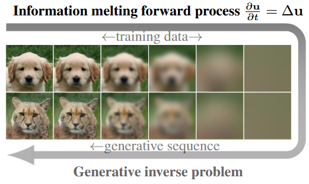
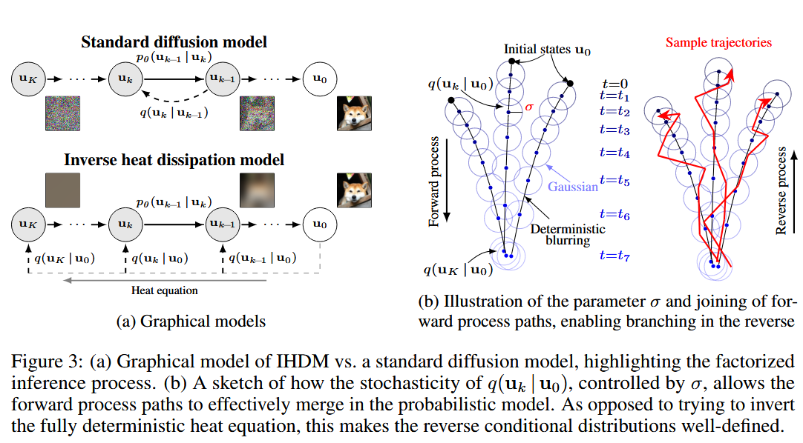
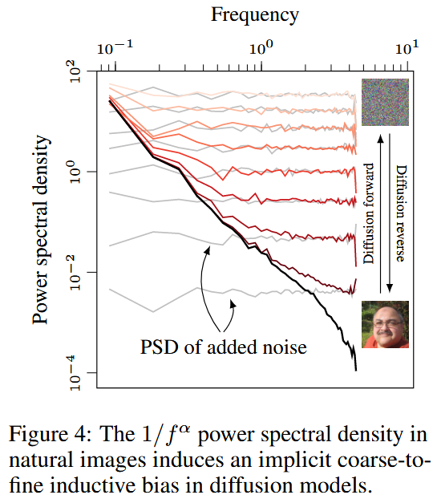

> **Generative Modelling with Inverse Heat Dissipation** ([arXiv](https://arxiv.org/abs/2206.13397))  
> Severi Rissanen, Markus Heinonen & Arno Solin  
> Aalto University  
> ICLR 2023  
> 
{: .paper-info-box }

---

## 1. Introduction
기존 딥러닝 방법론에서는 해상도(resolution) 개념 자체에 대한 관심이 상대적으로 적었고, 보통 스케일링은 단순한 sub-sampling pyramid를 기반으로 단계마다 해상도를 줄여가며 진행했다. 고전적인 컴퓨터 비전 분야에서는 **Gaussian scale-space**라고 불리는 접근 방식이 있다. 이 방식에서는 저해상도 버전의 이미지를 얻기 위해 열 방정식(heat equation)을 이미지 공간에서 수행하는데, 여기서 열 방정식은 열의 확산을 설명하는 편미분 방정식(PDE)이다.

_Fig.1: Example of the forward process and the generative inverse process._

방 안에 열이 고르게 퍼지는 것처럼, 열 방정식은 이미지를 평균화시키고, 세부 정보를 제거하지만, 픽셀 수를 줄이지 않고도(이미지 크기 유지) 임의의 해상도 수준을 얻을 수 있다. (Fig.1 참고) Scale-space는 회전 대칭성, 입력 이미지 이동에 대한 불변성, 스케일 불변성 등 일련의 scale-space axioms를 따른다. CNN 구조와 관련되어서는 scale-space가 연구된 적이 있지만, 생성형 모델에서는 아직 고려되지 않았다.

이 논문에서는 열 방정식을 직접적으로 역전시켜 기존의 diffusion 모델과 비슷한 생성형 모델을 제안하고, 이를 통해 기존 diffusion-type의 생성 모델이 같는 inductive bias를 탐구한다. 이를 통해 이미지의 실질적인 해상도를 증가시키고, 이 모델을 **Inverse Heat Dissipation Model(IHDM)**이라 부른다. (Fig.2 참고)

_Fig.2: 기존 Diffusion 모델과 IHDM의 비교. "확산" 개념의 초점이 기존 Diffusion은 pixel space에 있는 반면, IHDM은 2D Image plane에 있다._

직관적으로 보면, 순방향 과정에서는 원래 이미지의 정보가 소거되고, 그에 대응하는 확률적 역과정(stochastic reverse process)는 다양한 이미지를 복원하므로, 이러한 과정은 기존의 diffusion 모델과 유사하다. 순방향 과정에서 정보가 소거된 이미지 (평균화된 이미지)는 차원이 낮기 떄문에 (저주파 정보를 가짐) prior distribution에서의 샘플링은 용이하며, 이 논문에서는 train data에 기반한 kernel density estimate를 통해 prior distribution으로부터의 샘플링을 진행한다. (기존의 diffusion 모델은 prior distribution이 Guassian이였고, 그래서 식 전개가 가능했었다. 여기서는 어떨지?)

이 논문에서 주장하는 contribution은 다음과 같다.
1. 작은 additive noise가 포함된 열 방정식의 solution을 latent variable 모델에서의 추론 과정으로 해석함으로써, **열 역확산을 이용한 생성 모델링** 개념을 제시.
2. 열 방정식 기반 모델의 emergent properties를 분석
   1. 이미지의 전체적인 색상과 형태의 **분리(disentanglement).**[^1]
   2. **Smooth interpolation**
   3. 학습된 신경망에 forward process가 **simplicity**를 유됴하는 성질.
   4. **data efficiency**의 잠재력
3. Natural images의 power spectral density를 분석하여, 기존의 diffusion 모델이 서로 다른 유형의 coarse-to-fine 생성 방식을 수행하고 있었음을 밝히고, 이로부터 이 모델들의 inductive biases를 이해하는 통찰을 제공. 또 IHDM과 기존 diffusion 모델의 연결점 및 차이점을 설명.

---

## 2. Methods
Forward process에서 가장 주된 특징은 데이터셋의 이미지를 평균화 시켜 저차원의 subspace로 수축시킨다는 것이다.(Fig.2 의 오른쪽 참고) 이 과정을 heat equation으로 정의하고, 이는 열의 확산(dissipation)을 설명하는 선형 PDF로 표현할 수 있다.

$$
\text{Forward PDE Model:} \qquad \frac{\partial}{\partial t} u (x, y, t) = \Delta u(x, y, t) \tag{1}
$$

여기서 $u : \mathbb{R}^2 \times \mathbb{R}^+ \to \mathbb{R}$는 이미지의 한 채널의 2D 평면을 나타내고, $\Delta = \nabla^2$은 Laplace 연산자이다. 따라서, 위 수식에서 $u (x, y, t)$는 시간 $t$에서 $(x, y)$ 위치의 밝기값을 나타내고, $\frac{\partial}{\partial t} u (x, y, t)$는 특정 위치 $(x, y)$에서 시간에 따라 밝기가 어떻게 변하는지를 나타낸다. $\Delta u(x, y, t)$는 라플라스 연산자이므로, 주변 평균을 계산한다. 결국 이미지의 변화율을 주변 평균과의 차이로 계산하기 때문에 특정 픽셀이 주변보다 밝으면 점점 어두워지고, 주변보다 어두우면 점점 밝아져서 결과적으로 모든 픽셀이 주변 평균에 수렴하게 된다. 이 과정은 각 색상 채널에 대해 독립적으로 수행된다. 경계 조건으로는 이미지의 bounding box의 경계에서 도함수가 0이 되도록 하는 **Neumann 경계 조건**을 사용한다. 즉, $\partial u/\partial x = \partial u / \partial y - 0$이다. 이 조건 아래에서 $t \to \infty$일 떄, 각 색상 채널은 전체 이미지의 평균값으로 수렴한다. (즉, 이미지가 단색으로 변하게 된다. - RGB각각의 평균값) 결과적으로 이미지는 $\mathbb{R}^3$의 공간으로 projected된다.

원칙적으로 열 방정식은 무한한 수치 정밀도(numerical precision)이 주어진다면, 정확한 reverse process를 찾을 수 있지만, 본질적으로 열 방정식은 well-posed하지 않기 때문에 유한한 수치 정밀도 하에서는 정확한 역전이 불가능하다.

식 (1)에 제시된 PDE는 다음과 같이 evolution equation의 형태로 변환할 수 있다.

$$
u(x, y, t) = F(t)u(x, y, t) |_{t=t_0}
$$

여기서 $F(t) = \text{exp}[(t - t_0) \Delta]$는 evolution operator이며, 이는 operator exponential function으로 정의된다. 이 일반적인 표현을 사용하면, 라플라스 연산자($\Delta$)의 eigenbasis를 활용해 방정식을 효율적으로 풀 수 있다. 우리는 Neumann 경계 조건을 사용하므로, 이에 따른 eigenbasis는 cosine basis가 된다. (Appendix A.1 참고) 실제 데이터는 finite-resolution image이고, 이는 grid 위에 정의되며, 이로 인해 스펙트럼에는 자연스러운 컷오프 주파수(Nyquist limit)이 존재한다. 따라서 라플라스 연산자는 다음과 같은 eigendecomposition 형태로 표현할 수 있다.

$$
\Delta = V \Lambda V^T
$$

여기서 $V$는 cosine basis로 구성된 projection matrix이고, $\Lambda$는 대각 행렬로, negative squared frequencies가 위치하게 된다. 초기 상태 $u$는 DCT를 통해 eigenbasis로 변환되고($\tilde{u} = V^T u = \text{DCT}(u)$), 이 계산은 $\mathcal{O}(N \log N)$의 복잡도를 가진다. 최종적으로, 이 모델의 해는 **finite-dimensional evolution model**로 주어지며, 이는 주파수의 점진적인 decay 과정을 설명한다.

말이 어려운데 요약하자면, 우리는 열 방정식(식 1)을 풀어야 하는데, 수학적으로 효율적이게 계산하는 방법이 있다. 우리는 지금 forward process로 이미지를 점점 부드럽게 만들고 있는데, 이 과정을 수학적으로 표현하고 싶었다. 그런데 직접 계산하려면 너무 느리고 비효율적이여서, 이미지를 eigenbasis (고유 기저)로 변환한 후에 각 모드별로 얼마나 빠르게 사라지는지만 계산하면 훨씬 쉽다는 것이다.

$$
u(t) = F(t)u(0) = \text{exp}(V \Lambda V^T t)u(0) = V \text{exp}(\Lambda t) V^T u(0) \Leftrightarrow \tilde{u}(t) = \text{exp}(\Lambda t) \tilde{u}(0) \tag{2}
$$

여기서 $F(t) \in \mathbb{R}^{N\times N}$은 transition model이며, 실제로는 전개되지 않고, $u(0)$은 초기 상태이다. 행렬 $\Lambda$의 대각 성분은 negative wquared frequencies이며, 그 값은 다음과 같다.

$$
-\lambda_{n, m} = - \pi^2 (\frac{n^2}{W^2} + \frac{m^2}{H^2})
$$
여기서 $W$와 $H$는 각각 이미지의 가로와 세로 크기이다. $\Lambda$는 대각행렬이기 때문에 이 해는 계산 속도가 매우 빠르다.

식 2에 대한 설명을 추가로 하자면, $u(0)$는 초기 이미지를 말하고, $u(t)$는 $t$ step 이후의 이미지를 말한다. $V$는 고유벡터 행렬(DCT basis)이고, 이미지의 주파수 성분을 나타내는 축이라고 생각하면 된다. $\Lambda$는 고유값을 가지는 대각 행렬로, 각 주파수가 얼마나 빨리 사라지는지를 나타낸다. $\tilde{u}(t) = \text{exp}(\Lambda t) \tilde{u}(0)$는 주파수 공간으로 변환된 이미지를 나타낸다. 따라서, 이 식은 이미지를 점점 부드럽게 만드는 forward 과정을 픽셀 공간에서의 연산 없이 주파수 공간에서 빠르고 정확하게 계산할 수 있게 해준다. 이미지를 주파수 성분으로 분해하고, 각 주파수마다의 고유한 감쇠율을 찾는 것으로 해결할 수 있다는 것이다.

이 열 방정식을 잘 보다보면 떠오르는 것이 있다. 가우시안 블러 (또는 가우시안 필터)와 비슷하다고 느껴지지 않는가? 맞다. 열 방정식은 이미지 처리에서 가우시안 블러 연산과 대응 관계를 가진다. 무한 평면 상에서, 열 방정식을 시간 $t$까지 시뮬레이션 하는 것은, 분산 $\sigma^2 = 2t$인 가우시안 커널의 컨볼루션 연산과 동일하다.

_Fig.3: (a) IHDM과 기존 diffusion 모델의 graphical representation. (b) $q(u_k | u_0)$의 확률성_

### 2.1 Generative Model Formulation
앞에서 우리는 열 방정식을 이용해서 이미지를 블러시키는 forward process를 정의했다. 이제 우리는 열 방정식을 stochastically하게 역전시키는 생성 모델(reverse process)를 정의해야 한다. 비록 수식 (2)를 형식적으로 역산할 수 있다고 하더라도, 우리가 관심 있는 것은 deterministic한 역문제가 아니라, 순방향 과정의 특성을 반영한 생성 모델을 수학적으로 정의해야 한다.

#### 2.1.1 Forward Process
생성 과정은 단일한 해로 수렴하기보다, **여러 개의 가능한 역경로(plausible reverse paths)**로 분기되어야 한다. 그렇지 않으면 생성형 모델에서 다양성이 사라지기 떄문이다. 이를 위해 우리는 forward process에 표준편차 $\sigma$를 가진 noise를 추가하여 가역성(reversibility)를 형식적으로 꺠뜨린다. 이 개념은 기존의 diffusion 모델과 같다. 이 방법은 **low frequency 성분이 완전히 사라지기 전에 잡음으로 전환되는 하한(lower limit)**을 설정하게 되며, 이로 인해 **reverse conditional distributions**가 확률론적으로 정의된다. (Fig. 3b 참고) Time steps $t_1, t_2, \cdots, t_K$를 정의하고, 각 시간 단계에 해당하는 latent variable을 $u_k$라고 하자. 이때, forward process, 또는 latent variable model에서의 변분 근사(variational approximation)는 다음과 같이 정의된다:

$$
\begin{array}{c}
\text{Forward process /} \\
\text{Inference distribution}
\end{array}
\quad
q(\mathbf{u}_{1:K} \mid \mathbf{u}_0) 
= \prod_{k=1}^K q(\mathbf{u}_k \mid \mathbf{u}_0) 
= \prod_{k=1}^K \mathcal{N}(\mathbf{u}_k \mid \mathbf{F}(t_k) \mathbf{u}_0, \sigma^2 \mathbf{I})
\tag{3}
$$

여기서 $\mathbf{F}(t_k)$는 시간 $t_k$까지 열 방정식을 시뮬레이션한 결과에 해당하는 linear transformation을 의미하며, 표준편차 $\sigma$는 작은 상수이다.

주목할 점은, 일반적인 diffusion 모델처럼 forward process가 markov chain으로 정의디는 것이 아니라, deterministic한 열 방정식 위에  observation 덧붙이는 방식으로 noise를 facotize한다는 점이다. 이는 Fig. 3a에서 시각적으로 표현되어 있다.

#### 2.1.2 Reverse Process
반면, reverse process는 markov chain으로 정의되며, prior state $\mathbf{u}_K$에서 시작하여, observed variable $\mathbf{u}_0$로 역전이 이루어진다. 이 reverse process는 gaussian conditional distribution으로 정의한다:

$$
\begin{array}{c}
\text{Reverse process /} \\
\text{Generative model}
\end{array}
\quad
p_\theta(\mathbf{u}_{0:K}) = p(\mathbf{u}_K) \prod_{k=1}^K p_\theta(\mathbf{u}_{k-1} \mid \mathbf{u}_k)
= p(\mathbf{u}_K) \prod_{k=1}^K \mathcal{N}(\mathbf{u}_{k-1} \mid \mu_\theta(\mathbf{u}_k, k), \delta^2 \mathbf{I})
\tag{4}
$$

여기서 $\theta$는 모델의 파라미터들이고, $\delta$는 샘플링 과정에서 추가되는 noise의 표준편차이다. 이 식은 기존의 diffusion 모델의 reverse process와 크게 다를 바가 없는 것을 확인할 수 있다. 전체 구조는 Fig. 3a에 나타나 있고, 이 그림은 기존 diffusion 모델과의 구조적 차이점을 나타낸다. Fig. 3b는 noise 파라미터 $\sigma$와 $\delta$의 대한 직관을 제공한다.

$\sigma$는 오차 허용도(error tolerance) 또는 relaxation parameter 역할을 하며, 두 개의 블러 처리된 이미지가 사실상 구분이 안 될 정도로 얼마나 가까워야 하는지 측정한다. $\sigma > 0$인 경우, 초기 상태 $\mathbf{u}_K$는 여러 경로를 따라갈 확률적 가능성을 가지게 된다. 이 과정은, forward process에서 결정론적인 경로를 따라가면, 생성형 모델로서의 다양성이 사라지기 때문에, 일부러 확률적인 항을 두어서 다양성을 부여하는 것과 같다. 반면, $\delta$는 샘플링 시의 확률성을 제어하는 파라미터로, 이는 곧 생성 경로를 결정하게 된다. NCSN에서 랑주뱅 동역학으로 샘플링을 하는 것과 비슷하다고 생각할 수 있을 것 같다.

#### 2.1.3 Objective
이제 목적 함수를 설정해야 한다. IHDM이 달성하고자 하는 목표는 데이터의 주변 우도(marginal likelihood)를 최대화 하는 것이다. 이는 다음과 같이 정의된다:

$$
p(\mathbf{u}_0) = \int p_\theta (\mathbf{u}_0 \mid \mathbf{u}_{1:K}) \, p_\theta (\mathbf{u}_{1:K}) \, \mathrm{d}\mathbf{u}_{1:K}
$$

이는 잠재 변수 $$\mathbf{u}_{1\colon K}$$ 를 적분하여 얻는 marginal likelihood이다. 이제 여기에 VAE 방식의 ELBO를 유도한다. 이미 정의된 generative distribusion $p_\theta$와 inference distribution $q$를 사용하면 다음과 같은 식을 얻게 된다:

$$
-\log p_\theta(\mathbf{u}_0)
\leq \mathbb{E}_q \left[ -\log \frac{p_\theta(\mathbf{u}_{0:K})}{q(\mathbf{u}_{1:K} \mid \mathbf{u}_0)} \right]
\tag{5}
$$

$$
= \mathbb{E}_q \left[
    -\log \frac{p_\theta(\mathbf{u}_K)}{q(\mathbf{u}_K \mid \mathbf{u}_0)}
    - \sum_{k=2}^K \log \frac{p_\theta(\mathbf{u}_{k-1} \mid \mathbf{u}_k)}{q(\mathbf{u}_{k-1} \mid \mathbf{u}_0)}
    - \log p_\theta(\mathbf{u}_0 \mid \mathbf{u}_1)
\right]
\tag{6}
$$

$$
= \mathbb{E}_q \left[
    \underbrace{D_{\mathrm{KL}}[q(\mathbf{u}_K \mid \mathbf{u}_0) \,\|\, p(\mathbf{u}_K)]}_{L_K}
    + \sum_{k=2}^K \underbrace{D_{\mathrm{KL}}[q(\mathbf{u}_{k-1} \mid \mathbf{u}_0) \,\|\, p_\theta(\mathbf{u}_{k-1} \mid \mathbf{u}_k)]}_{L_{k-1}}
    - \underbrace{\log p_\theta(\mathbf{u}_0 \mid \mathbf{u}_1)}_{L_0}
\right]
\tag{7}
$$

DDPM 논문에 있던 식 전개와 완전히 동일하다. 여기서 $L_{k-1}$ 항들은 Forward process에서의 가우시안 분포와 reverse process에서의 가우시안 분포 간의 KL divergence를 의미한다. 그래서 추가로 수식을 전개해볼 수 있는데, 이 식을 전개하면 다음과 같은 식을 얻게 된다.

$$
\mathbb{E}_q[L_{k-1}]
= \mathbb{E}_q \left[ D_{\mathrm{KL}}\left(q(\mathbf{u}_{k-1} \mid \mathbf{u}_0) \,\|\, p_\theta(\mathbf{u}_{k-1} \mid \mathbf{u}_k) \right) \right]
\tag{8}
$$

$$
= \frac{1}{2} \left(
\frac{\sigma^2}{\delta^2} N - N
+ \frac{1}{\delta^2} \mathbb{E}_{q(\mathbf{u}_k \mid \mathbf{u}_0)} \left[
\left\| \underbrace{
\mu_\theta(\mathbf{u}_k, k) - \mathbf{F}(t_{k-1}) \mathbf{u}_0
}_{f_\theta(\mathbf{u}_k, k) - (\mathbf{F}(t_{k-1}) \mathbf{u}_0 - \mathbf{u}_k)}
\right\|_2^2
\right]
+ 2N \log \frac{\delta}{\sigma}
\right),
\tag{9}
$$

$$
\mathbb{E}_q[L_0]
= \mathbb{E}_q[-\log p_\theta(\mathbf{u}_0 \mid \mathbf{u}_1)]
= \frac{1}{2\delta^2} \mathbb{E}_{q(\mathbf{u}_1 \mid \mathbf{u}_0)} \left[
\left\| \underbrace{
\mu_\theta(\mathbf{u}_1, 1) - \mathbf{u}_0
}_{f_\theta(\mathbf{u}_1, 1) - (\mathbf{u}_0 - \mathbf{u}_1)}
\right\|_2^2
\right]
+ N \log(\delta \sqrt{2\pi})
\tag{10}
$$

여기서 $N$은 이미지에서 픽셀의 개수이다. 저자는 loss function을 inference distribution $q(\mathbf{u}_{1:K} \mid \mathbf{u}_0)$로부터 단일 몬테카를로 샘플을 사용해 평가한다. 모든 단계에서의 loss는 MSE이며, 이는 분산 $\sigma^2$을 가지는 noise가 추가된 블러 이미지로부터 약간 덜 블러 처리된 이미지를 예측하는 것과 같다.

샘플링 과정은 다음 두 간계를 번갈아 수행한다.
1. 신경망으로부터 평균 업데이트
2. 분산 $\delta$를 가지는 가우시안 노이즈 추가

_Alg. 1: 학습 과정, Alg. 2: 샘플링 과정_

학습 과정은 Alg. 1, 샘플링 과정은 Alg. 2에 요약되어 있으며, 둘 다 구현이 간단하다. 실제로 이 알고리즘이 의미하는 것은 신경망이 이미지를 deblurring하도록 학습시키고, 샘플링은 deblurring과 노이즈 추가를 번갈아가며 수행하는 과정이다.

추가로, 저자는 학습을 안정화시키기 위해서 $\mu_\theta(\mathbf{u}_k, k)$를 skip connection을 활용해 다음과 같이 파라미터화한다:

$$
\mu_\theta(\mathbf{u}_k, k) = \mathbf{u}(k) + f_\theta(\mathbf{u}_k, k)
$$

이 구조는 미분방정식을 역방향으로 아주 작게 되돌아가는 방식을 구현하려는 의도를 반영한다. 이렇게 skip connection을 사용하면, 수식 (9), (10)에 등장하는 손실 함수는 denoising score matching 목적 함수와 유사해진다. (똑같은..데요?) 단, 차이점은 $$\mathbf{u}_k$$의 denoised된 버전을 예측하는 것이 아니라, 덜 흐릿한(less blurry)한 $\mathbf{u}_{k-1}$를 예측하는 것이다.

#### 2.1.4 Prior Distribution
사전 분포 $ p(\mathbf{u}_K)$에 대해서는 기존의 diffusion model은 일반 가우시안 분포를 사용했으나, IHDM에서는 이미지가 블러 처리 되었을 뿐 pixel space에서 가우시안 분포를 사용하지 않기 떄문에, 가우시안 분포를 사용할 수 없다. 대신 흐릿해진 이미지들이 사실상 매우 저차원의 subspace에 위치하기 때문에, 표준적인 밀도 추정(density estimation) 기법을 무엇이든 자유롭게 사용할 수 있다.

논문에서는 분산 $\sigma^2$을 가지는 Gaussian kernel density estimate를 사용하며, 이 방식은 level $K$에서의 블러 이미지들이 저차원이 서로 충분히 가까운 경우 합리적인 근사 기법이 될 수 있다. 결국, 샘플링 시작 시 첫 샘플을 얻기 위해서, 가우시안 분포로부터 샘플링을 진행하는 것이 아닌, 학습 데이터 중 하나를 선핵하고, $\mathbf{F}(t_K)$를 적용하여 블러 처리된 이미지를 얻은 후, $\sigma^2$의 노이즈를 추가한다. 부록 A.3에서는 계산의 용이성을 위해 수치적 적분 없이 풀 수 있게 도와주는 $L_K$에 대한 variational upper bound를 추가로 제시한다.

#### 2.1.5 Asymptotics

이 모델은 명시적인 multi-scale 특성을 도입했다는 점에서 분명 장점이 있지만, 동시에 기존 diffusion 모델들이 갖고 있던 일부 이론적 특성은 포기하게 된다. 예를 들어, DDPM이나 SDE 기반 확산 모델에서는 **무한한 스텝 수 $ K \to \infty $**의 극한에서 **가우시안 역전이(Gaussian reverse transition)**가 최적이라는 이론적 보장이 존재하지만, IHDM에서는 이러한 보장이 성립하지 않는다.

그럼에도 불구하고, 이 모델은 **초기 score-based generative modeling** 접근(Song & Ermon, 2019; 2020)과의 연결점을 제공하며 직관을 준다. 구체적으로는 다음과 같다:

- $ K \to \infty $의 극한에서, 각 스텝의 손실 함수 $ L_k $는 **노이즈 수준 $\sigma$**를 갖는 **denoising score matching 손실 함수**와 **동등해진다**.
- 만약 $ \delta = \sqrt{2} \sigma $로 설정한다면, 샘플링 과정은 **Langevin dynamics**를 이용해 **고정된 blur 수준에서 샘플링을 수행하는 것과 동등**해진다.
- 이 경우, 생성 과정은 **덜 흐릿한(less blurry) 분포로 점진적으로 수렴(annealing)**하는 형태로 해석할 수 있다.

다만 실제 구현에서는, 우리는 단순한 Langevin dynamics를 따르기보다는 **열 방정식의 역방향으로 명확하게 step을 되돌아가는 방식**을 채택하며, $ \delta = \sqrt{2} \sigma $라는 제약도 두지 않는다. 그럼에도 이러한 분석은 다음과 같은 **중요한 직관**을 제공한다:

- 왜 **가우시안 전이(Gaussian transition)**가 합리적인 선택인지에 대한 근거
- $ \delta / \sigma $의 **초기 추정값(first guess)**에 대한 이론적 근거

(자세한 내용은 Appendix A.4에 수록되어 있다.)

### 2.2 Implicit Coarse-to-Fine Generation in Diffusion Models

자연 이미지의 **주파수 거동(frequency behaviour)**은 본 모델(IHDM)과 기존 diffusion 모델 간의 연결점과 차이점을 명확하게 보여준다. 동시에 실제로 diffusion 모델들이 **coarse-to-fine 방식**으로 정보를 생성하는 경향이 있다는 잘 알려진 현상에 대해서도 설명해준다.

자연 이미지의 **파워 스펙트럼 밀도(PSD)**는 대략적으로 **역수 법칙(power law)** $ 1/f^\alpha $를 따른다. 여기서 $ \alpha \approx 2 $인 경우가 많다 (van der Schaaf & van Hateren, 1996; Hyvärinen et al., 2009). 이 값은 **로그-로그 스케일**에서 PSD가 거의 직선으로 나타난다는 것을 의미하며, 고주파보다 저주파 성분이 훨씬 더 강하게 나타난다는 것을 뜻한다.

부록 A.5에서는 **등방 가우시안 노이즈(isotropic Gaussian noise)**를 이미지에 추가하면, **노이즈의 PSD와 원본 이미지의 PSD가 기대값 차원에서 더해진다(additive)**는 사실을 보인다. 이 말은 곧, 고주파 성분(high-frequency components)은 노이즈에 의해 쉽게 잠식(drown out)되지만, **저주파 성분은 초기에는 유지된다**는 뜻이다.

_Fig.4: PSD_

노이즈를 점점 더 추가해갈수록, 점점 더 많은 주파수 성분이 잠식되고, 결국 가장 낮은 주파수 성분까지 사라지게 된다. 이 과정은 Fig. 4의 **빨간색 PSD 시각화**로 보여진다. 따라서 **역방향(reverse) 과정**에서는, diffusion 모델이 coarse 구조에서 시작해 점진적으로 세밀한 fine detail을 생성해내는 방향으로 주파수 성분을 만들어간다는 것을 알 수 있다.

이러한 **스펙트럼 기반의 유도 편향(spectral inductive bias)**은 Kreis et al. (2022)에서도 독립적으로 언급된 바 있으며, 부록 B.6에는 PSD 계산에 대한 자세한 수식과 분석이 포함되어 있다.

## Summary
이 논문은 사실 Forward process를 정의하는 방식을 제외하고는 기존의 Diffusion 모델과 크게 다를 바가 없다. 하지만 forward process에서 열 방정식을 사용하여 deterministic한 평균화에 작은 noise를 추가한다는 점, 그레서 이미지의 형태(저주파 성분)보다 작은 텍스쳐(고주파 성분)이 먼저 사라진다는 점이 내가 지금 연구하고 있는 아이디어와 잘 맞아 떨어지는 것 같다.

---
[^1]: StyleGAN 이후로 disentanglement에 대한 단어가 많이 쓰이는 듯? 이미지의 어떤 특성 간의 분리를 말한다. 즉 latent space에서 서로 다른 특성들이 얼마나 독립적인지를 나타낸다.
