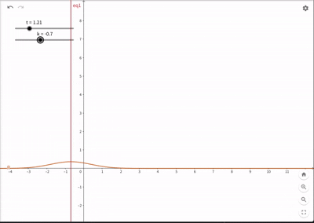

## 시작에 앞서..

> 이 포스팅 시리즈는 Diffusion을 공부하다 SDE를 공부해야한다는 생각으로 혼자 책을 읽으며 정리한 글입니다. Bernt Øksendal 교수님의 책 "Stochastic Differential Equations: An Introduction with Applications[^1]"을 참고하여 작성하였습니다.
{:.prompt-tip}

---

지난 [2.1장 (Part 2)]()에서 우리는 Kolmogorov Extension Theorem이라는 강력한 도구를 얻었다.

> "우리가 유한한 시점들의 확률 분포(CCTV 스냅샷)만 모순 없이 정의하면, 전체 시간을 아우르는 확률 과정이 수학적으로 존재한다!"

이제 이 면허증을 가지고 실제로 '자동차'를 만들어볼 차례다. 확률미분방정식(SDE)의 엔진이자 가장 중요한 예시인 **브라운 운동(Brownian Motion)**을 수학적으로 엄밀하게 정의해 보자.

---

## 1\. 브라운 운동의 구성 (Construction)

1828년, 식물학자 로버트 브라운(Robert Brown)은 액체 위의 꽃가루 입자가 불규칙하게 움직이는 것을 관찰했다. 이 움직임은 액체 분자들의 무작위 충돌 때문인데, 이를 수학적으로 모델링하기 위해 확률 과정 $B_t(\omega)$를 도입한다.

우리는 Kolmogorov의 정리를 믿고, \*\*유한 차원 분포(Finite-dimensional distributions)\*\*를 먼저 정의할 것이다. 즉, 입자가 $x$에서 시작해서 시간 $t$ 후에 $y$로 갈 확률 밀도를 지정하면 된다.

### 1.1 전이 확률 밀도 (Transition Probability Density)

먼저 시작점 $x \in \mathbb{R}^n$을 고정하고, 함수 $p(t, x, y)$를 다음과 같이 정의하자.

$$
p(t, x, y) = (2\pi t)^{-n/2} \cdot \exp\!\left( -\frac{|x - y|^2}{2t} \right), \qquad y \in \mathbb{R}^n,\ t > 0.
$$

*(GIF 설명: $t$와 $x$가 변함에 따라 확률밀도함수 $p$의 개형이 어떻게 변하는지 보여준다. 시간이 지날수록($t \uparrow$) 그래프가 납작하고 넓게 퍼지는 것을 확인할 수 있다.)*

위 식에서 $x$는 **현재 위치(출발점)**, $t$는 **경과 시간**, 그리고 $y$는 \*\*미래의 위치(도착점)\*\*를 의미한다.
즉, $p(t, x, y)$는 다음과 같은 질문에 대한 수학적인 대답이다.

> "지금 $x$에 있는 입자가 $t$초 뒤에 $y$라는 위치 근처에 있을 확률 밀도는 얼마인가?"

이를 조건부 확률 밀도 표기법으로 쓰면 더 직관적이다.

$$p(t, x, y) = f_{B_t | B_0}(y | x)$$

  * **$x$ (Start):** 확산이 시작되는 중심점이다. 위 GIF에서 정규분포의 봉우리가 위치한 곳이 바로 $x$다.
  * **$y$ (End):** 우리가 확률을 계산하고 싶은 **도착지 후보**들이다. 적분 변수라고 생각하면 편하다.
  * **Transition (전이):** 상태가 $x$에서 $y$로 바뀐다는 뜻이다. 이 확률 밀도는 입자가 시간 $t$ 동안 $x$에서 $y$로 '이동(Transition)'할 가능성을 나타낸다.

예를 들어 $n=1$ (1차원)이고 $x=0$ (원점 출발)이라 하자.

  * $t=1$일 때, 입자가 정확히 $y=2$에 있을 확률 밀도는 $p(1, 0, 2) = \frac{1}{\sqrt{2\pi}} e^{-2}$이다.
  * 반면 $y=0$에 있을 확률 밀도는 $p(1, 0, 0) = \frac{1}{\sqrt{2\pi}}$로 더 높다. (멀리 갈수록 확률이 줄어든다.)

### 1.2 유한 차원 분포의 정의와 해석

이제 시간 순서 $0 \leq t_1 \leq t_2 \leq \cdots \leq t_k$에 대해, 입자가 각 시점에 특정 영역 $F_i$를 통과할 확률 $\nu_{t_1, \dots, t_k}$를 정의한다.

여기서 $\nu_{t_1, \dots, t_k}$는 **$\mathbb{R}^{nk}$ 공간 위의 측도(Measure)**, $k$개의 시점에서 입자의 위치 $(B_{t_1}, \dots, B_{t_k})$가 가지는 결합 확률 분포(Joint Distribution)를 의미한다.

$$
\nu_{t_1, \dots, t_k} (F_1 \times \cdots \times F_k) \\
= \int_{F_1 \times \cdots \times F_k} \underbrace{p(t_1, x, x_1)}_{\text{Step 1}} \cdot \underbrace{p(t_2 - t_1, x_1, x_2)}_{\text{Step 2}} \cdots \underbrace{p(t_k-t_{k-1}, x_{k-1}, x_k)}_{\text{Step k}} d x_1 \cdots d x_k \tag{2.2.1}
$$

식이 길고 복잡해 보이지만, 핵심은 **"독립적인 이동의 곱"**이다. 이 식을 해석하는 방법은 다음과 같다.

1.  **Step 1 ($x \to x_1$):** 시간 $t_1$ 동안 $x$에서 $x_1$으로 이동할 확률 밀도 $p(t_1, x, x_1)$.
2.  **Step 2 ($x_1 \to x_2$):** 시간 $(t_2 - t_1)$ 동안, 바로 직전 위치인 $x_1$에서 $x_2$로 이동할 확률 밀도 $p(t_2-t_1, x_1, x_2)$.
3.  **Chain:** 이를 $k$번째까지 계속 곱한다. (Markov Property: 미래는 현재($x_{i-1}$)에만 의존하고 과거와는 무관하다.)
4.  **Integrate:** 우리가 관심 있는 영역 $F_1, \dots, F_k$에 대해 모든 가능한 경로를 적분한다.

예시를 들어보자. 1차원 브라운 운동($n=1$)이 원점($x=0$)에서 시작한다고 가정하자. 우리는 다음 확률을 구하고 싶다.

> **Q. 간단한 예시**
>
> 1초 뒤($t_1=1$)에는 $[1, 2]$ 구간에 있고, 다시 2초 더 지나서 총 3초 뒤($t_2=3$)에는 $[-1, 0]$ 구간에 있을 확률은?
{:.example-box}

이 상황을 식 (2.2.1)에 대입하면 다음과 같다.

  * **초기 조건:** $x=0$
  * **시간:** $t_1 = 1, \quad t_2 = 3$ (따라서 두 번째 이동 시간은 $3 - 1 = 2$초)
  * **영역:** $F_1 = [1, 2], \quad F_2 = [-1, 0]$

구하려는 확률 $P$는 다음과 같이 계산된다.

$$
P = \int_{1}^{2} \int_{-1}^{0} \underbrace{p(1, 0, x_1)}_{\text{0에서 } x_1 \text{으로 1초 이동}} \cdot \underbrace{p(2, x_1, x_2)}_{\text{ } x_1 \text{에서 } x_2 \text{로 2초 이동}} \, dx_2 \, dx_1
$$

이를 $p(t, x, y)$의 정의에 따라 풀어서 쓰면:

$$
P = \int_{1}^{2} \left( \int_{-1}^{0} \frac{1}{\sqrt{2\pi \cdot 1}} e^{-\frac{(x_1 - 0)^2}{2 \cdot 1}} \cdot \frac{1}{\sqrt{2\pi \cdot 2}} e^{-\frac{(x_2 - x_1)^2}{2 \cdot 2}} \, dx_2 \right) dx_1
$$

이 적분식은 **"$1$초 뒤에 $x_1$을 거쳐서, $3$초 뒤에 $x_2$로 가는 모든 경로들의 확률 밀도 합"**을 의미한다. Kolmogorov 확장 정리는 이렇게 정의된 확률들이 모순 없이 전체 확률 과정을 구성함을 보장해 준다.

> **Definition 2.2.1. (Brownian Motion)**
>
> 위 식 (2.2.1)로 정의된 유한 차원 분포를 가지며, Kolmogorov 확장 정리에 의해 존재하는 확률 과정을 **$x$에서 시작하는 브라운 운동(Brownian motion starting at $x$)**이라고 부른다.
> (당연히 $P^x (B_0 = x) = 1$이다.)
{:.definition-box}

---

## 2. Canonical Brownian Motion과 연속성

우리는 브라운 운동의 확률 분포를 정의했다. 하지만 여기에는 수학적으로 **아주 치명적인 허점**이 하나 숨어 있다.

우리가 정의한 것은 "특정 시점 $t$에 입자가 어디에 있을 확률"일 뿐이다. $t_1$과 $t_2$ 사이의 아주 짧은 찰나에 입자가 우주 끝까지 갔다 왔는지, 아니면 순간이동을 했는지에 대해서는 식 (2.2.1)이 아무런 제약을 걸지 않는다.

하지만 물리적으로 꽃가루는 **순간이동을 하지 않는다.** 즉, 입자의 움직임 $t \mapsto B_t(\omega)$는 **연속(Continuous)**이어야 한다.

이번 섹션에서는 이 수학적 허점을 메우고, 브라운 운동을 '연속적인 경로'로 확정 짓는 과정을 다룬다.

### 2.1 Version: "확률은 같지만 경로는 다르다?"

이 문제를 해결하기 위해 **Version(수정판)**이라는 개념을 먼저 이해해야 한다. "확률 과정이 같다"는 말은 두 가지 의미로 해석될 수 있기 때문이다.

> **Definition 2.2.2 (Version)**
>
> 두 확률 과정 $\{X_t\}$와 $\{Y_t\}$가 모든 시각 $t$에 대해
> $$P(X_t = Y_t) = 1$$
> 을 만족하면, 서로가 서로의 **Version**이라고 한다.
{:.definition-box}

이 정의가 조금 억울하게 느껴질 수 있다. "매 순간 확률이 1로 같으면 그냥 같은 거 아니야?"라고 생각할 수 있지만, 다음 예시를 상상해보자.

#### [예시] "깜빡임"이 있는 확률 과정
* **과정 A:** 가만히 멈춰있는 입자 ($X_t(\omega) = 0$ for all $t$). $\rightarrow$ **연속이다.**
* **과정 B:** 가만히 있다가, 무작위 시간 $T$에 딱 한 번 '반짝'하고 1로 튀었다가 돌아오는 입자. $\rightarrow$ **불연속이다.**

우리가 특정 시간 $t$를 딱 찍어서 관찰한다고 치자. 과정 B가 튀어 오르는 시간 $T$가 정확히 내가 관측한 시간 $t$와 일치할 확률은 0이다 (연속 시간에서 한 점의 확률은 0이므로).
즉, 우리는 언제 관측하든 $P(X_t = Y_t) = 1$이라고 말할 수 있다.

하지만 경로 전체를 놓고 보면, $X_t$는 매끄럽지만 $Y_t$는 튀는 구간이 있다. **즉, 유한 차원 분포(CCTV)만으로는 경로의 연속성을 보장할 수 없다.**

### 2.2 Kolmogorov's Continuity Theorem (연속성 정리)

우리의 목표는 "브라운 운동의 수많은 Version 중에서, 경로가 끊기지 않고 연속인 녀석이 존재하는가?"를 확인하는 것이다.

이때 **Kolmogorov의 연속성 정리**가 구세주처럼 등장한다. 이 정리는 **"확률 과정이 시간 차이에 비해 너무 크게 날뛰지 않으면, 연속인 버전이 존재한다"**는 것을 수학적으로 보장해 준다.

> **Theorem 2.2.3 (Kolmogorov's Continuity Theorem)**
>
> 확률 과정 $X_t$가 다음 부등식을 만족하는 양의 상수 $\alpha, \beta, D$가 존재한다고 하자.
>
> $$E[|X_t - X_s|^\alpha] \le D\, |t - s|^{1 + \beta}, \quad (0 \le s, t \le T)$$
>
> 그러면 $X_t$는 **Continuous Version(연속적인 경로를 가진 수정판)**을 가진다.
{:.theorem-box}
이 부등식은 **"이동 거리의 기댓값($E[\left| \Delta X \right|^\alpha]$)이 시간 간격($\Delta t$)보다 훨씬 더 빠르게($1+\beta$ 차수) 줄어들어야 한다"**는 뜻이다. 시간이 줄어들 때 변동폭이 급격하게 0으로 수렴하므로, 그래프가 중간에 점프(불연속)할 틈을 주지 않는다는 의미로 받아들이면 된다.

### 2.3 브라운 운동의 연속성 검증

이제 브라운 운동 $B_t$가 이 조건을 만족하는지 확인해보자. 정규분포의 성질을 이용해 $B_t - B_s$의 4차 모멘트를 계산하면 다음과 같다 (연습문제 2.8).

$$
E^x[|B_t - B_s|^4] = n(n+2)\, |t - s|^2
$$

이 식을 Kolmogorov의 조건과 비교해보자.
* $\alpha = 4$
* $D = n(n+2)$
* $1 + \beta = 2 \implies \mathbf{\beta = 1 > 0}$

조건이 완벽하게 성립한다!
따라서, **브라운 운동은 수학적으로 연속인 경로를 가진 Version이 반드시 존재한다.**

### 2.4 Canonical Brownian Motion

이제 우리는 안심하고 선언할 수 있다. 앞으로 우리는 수많은 브라운 운동의 버전 중, **경로가 연속인 것만 골라서** 다룰 것이다.

이를 더 엄밀하게 하기 위해, 아예 확률 공간 자체를 **"연속 함수들의 집합"**으로 제한해 버리기도 한다.

> **Definition. (Canonical Brownian Motion)**
>
> 표본 공간을 $\Omega = C([0,\infty), \mathbb{R}^n)$ (시작점에서 출발하는 모든 연속 함수들의 공간)으로 잡고, 이 위에서 정의된 확률 측도로 브라운 운동을 정의한다.
> 이를 **Canonical Brownian Motion**이라 한다.
{:.definition-box}

이 공간은 **Polish Space(완비 분해 가능 거리 공간)**라는 아주 좋은 성질을 가지고 있어서, 이후에 극한을 취하거나 해석학적인 연산을 할 때 든든한 배경이 되어준다.

---

## 3. 브라운 운동의 기본 성질 (Basic Properties)

앞서 우리는 Kolmogorov 확장 정리를 통해 브라운 운동의 존재성을 보장받았고, 연속성 정리를 통해 경로가 끊어지지 않음을 확인했다. 이제 $B_t$가 구체적으로 어떤 수학적 성질을 가지는지, 책에 소개된 수식들을 하나씩 뜯어보며 엄밀하게 살펴보자.

### (i) 가우시안 과정 (Gaussian Process)

브라운 운동의 가장 근본적인 특징은 그것이 **가우시안 과정(Gaussian Process)**이라는 점이다. 이는 $B_t$의 임의의 유한한 시점들 $0 \le t_1 \le \cdots \le t_k$에 대해, 벡터 $Z = (B_{t_1}, \dots, B_{t_k}) \in \mathbb{R}^{nk}$가 **다변량 정규분포(Multivariate Normal Distribution)**를 따른다는 것을 의미한다.

이를 수학적으로 증명하기 위해, 우리는 확률변수의 '지문'과도 같은 **특성함수(Characteristic Function)**를 확인해야 한다. 다변량 정규분포의 특성함수는 다음과 같은 꼴을 가져야 한다.

$$
E^x\!\left[ \exp\!\left( i \sum_{j=1}^{nk} u_j Z_j \right) \right]
=
\exp\!\left(
- \frac{1}{2}\sum_{j,m} u_j c_{jm} u_m
+ i \sum_j u_j M_j
\right)
\tag{2.2.3}
$$

여기서 $u \in \mathbb{R}^{nk}$는 임의의 벡터이고, $M$은 평균 벡터, $C=[c_{jm}]$은 공분산 행렬이다.
앞서 정의한 브라운 운동의 유한 차원 분포 식 (2.2.2)를 이용하여 좌변을 실제로 계산해 보면(부록 A 참조), 위와 정확히 일치하는 형태를 얻을 수 있다. 이때 도출되는 $M$과 $C$는 다음과 같다.

#### 1) 평균 벡터 (Mean Vector)

$$
M = E^x[Z] = (x, x, \dots, x) \in \mathbb{R}^{nk} \tag{2.2.6}
$$

즉, 모든 시점 $t$에 대해 기댓값은 항상 시작점 $x$이다.

$$E^x[B_t] = x \tag{2.2.8}$$

#### 2) 공분산 행렬 (Covariance Matrix)
계산을 통해 얻어진 공분산 행렬 $C$는 다음과 같은 블록 행렬(Block Matrix) 형태를 띤다.

$$
C =
\begin{pmatrix}
t_1 I_n & t_1 I_n & \cdots & t_1 I_n \\
t_1 I_n & t_2 I_n & \cdots & t_2 I_n \\
\vdots & \vdots & \ddots & \vdots \\
t_1 I_n & t_2 I_n & \cdots & t_k I_n
\end{pmatrix} \tag{2.2.7}
$$

이 행렬의 성분이 의미하는 바는 다음과 같다.

$$
E^x[(B_t - x)^2] = n t \tag{2.2.9a}
$$

$$
E^x[(B_t - x)(B_s - x)] = n \min(s, t) \tag{2.2.9b}
$$

공분산이 $\min(s, t)$라는 것은 매우 중요하다. $s < t$라고 하면, $B_s$와 $B_t$의 상관관계는 더 이른 시간인 $s$에 의해 결정된다는 뜻이다. 시간이 흐를수록($t$가 커질수록) 분산($nt$)은 선형적으로 증가한다.

또한, 이 공분산 식을 이용하면 **증분(Increment)의 분산**도 계산할 수 있다. $t \ge s$일 때,

$$
\begin{aligned}
E^x[(B_t - B_s)^2]
&= E^x[((B_t - x) - (B_s - x))^2] \\
&= E^x[(B_t - x)^2] - 2E^x[(B_t - x)(B_s - x)] + E^x[(B_s - x)^2] \\
&= nt - 2n\min(s, t) + ns \\
&= nt - 2ns + ns \\
&= n(t - s)
\end{aligned} \tag{2.2.10}
$$

즉, **이동 거리의 제곱 평균(분산)은 시간 차이 $(t-s)$에 정확히 비례**한다.

### (ii) 독립 증분 (Independent Increments)

브라운 운동의 또 다른 핵심 성질은 **독립 증분**을 가진다는 것이다.

$$
B_{t_1},\; B_{t_2} - B_{t_1},\; \dots,\; B_{t_k} - B_{t_{k-1}}
\quad \text{are independent} \tag{2.2.11}
$$

(단, $0 \le t_1 < t_2 < \cdots < t_k$)

이것을 어떻게 증명할 수 있을까?
여기서 **"가우시안 과정"**이라는 성질이 강력한 무기가 된다. 정규분포를 따르는 확률 변수들은 **"상관관계가 없으면(Uncorrelated, 공분산이 0이면) 서로 독립(Independent)이다"**라는 고유한 성질이 있다.

따라서 우리는 굳이 결합 확률 밀도 함수를 다 쪼개볼 필요 없이, **공분산이 0이 됨**만 보이면 충분하다.

#### 증명 과정
임의의 겹치지 않는 두 구간 $t_{i-1} < t_i$ 와 $t_{j-1} < t_j$ (단, $t_i \le t_{j-1}$)를 생각하자.
우리는 다음 식을 보이면 된다.

$$
E^x\!\left[(B_{t_i} - B_{t_{i-1}})(B_{t_j} - B_{t_{j-1}})\right] = 0 \tag{2.2.12}
$$

좌변을 전개하여 기댓값의 선형성과 앞서 구한 공분산 공식($E[B_u B_v] = n \min(u, v)$)을 대입해 보자. (편의상 $x=0$이라 가정해도 무방하다.)

$$
\begin{aligned}
\text{LHS} &= E^x[B_{t_i} B_{t_j} - B_{t_{i-1}} B_{t_j} - B_{t_i} B_{t_{j-1}} + B_{t_{i-1}} B_{t_{j-1}}] \\
&= n \min(t_i, t_j) - n \min(t_{i-1}, t_j) - n \min(t_i, t_{j-1}) + n \min(t_{i-1}, t_{j-1})
\end{aligned}
$$

시간 순서가 $t_{i-1} < t_i \le t_{j-1} < t_j$이므로, $\min$ 값들은 다음과 같이 풀린다.
* $\min(t_i, t_j) = t_i$
* $\min(t_{i-1}, t_j) = t_{i-1}$
* $\min(t_i, t_{j-1}) = t_i$
* $\min(t_{i-1}, t_{j-1}) = t_{i-1}$

이를 대입하면:
$$
= n(t_i - t_{i-1} - t_i + t_{i-1}) = 0
$$

정확히 0이 된다!
따라서 브라운 운동의 증분들은 서로 상관관계가 없으며, 가우시안 과정이므로 **서로 독립**이다. 이로써 $s > t$일 때 $B_s - B_t$는 시점 $t$까지의 정보($\mathcal{F}_t$)와 독립임을 알 수 있다.

### (iii) 차원 간의 독립성

마지막으로 $n$차원 브라운 운동 $B_t = (B_t^{(1)}, \dots, B_t^{(n)})$을 성분별로 쪼개서 보자.
식 (2.2.1)의 정의에서 확률 밀도 함수는 각 차원의 곱으로 분해된다.

$$
p(t, x, y) = \prod_{j=1}^n \frac{1}{\sqrt{2\pi t}} \exp\left( -\frac{(x_j - y_j)^2}{2t} \right)
$$

이러한 구조 때문에, **각 성분 프로세스 $\{B_t^{(j)}\}_{t \ge 0}$ ($1 \le j \le n$)들은 서로 독립인 1차원 브라운 운동**이 된다.
즉, $x$축 방향의 움직임은 $y$축 방향의 움직임에 전혀 영향을 주지 않는다. 이는 다차원 SDE를 다룰 때 각 성분을 별도로 계산할 수 있게 해주는 편리한 성질이다.

---

## 정리하며

우리는 2.1장과 2.2장에 걸쳐 확률미분방정식의 토대가 되는 **브라운 운동**을 엄밀하게 정의했다.

1.  **Kolmogorov 확장 정리**를 통해 확률 과정의 존재성을 보였고,
2.  **Kolmogorov 연속성 정리**를 통해 경로가 끊어지지 않음을 보장했으며 ($Version$),
3.  **가우시안 성질**을 통해 평균, 분산, 공분산, 그리고 독립 증분 성질을 수학적으로 확인했다.

하지만 이 아름다운 브라운 운동은 미분 불가능(non-differentiable)하다는 치명적인 특징을 가진다. 다음 장에서는 일반적인 미분적분학(Calculus)이 통하지 않는 이 거친 경로를 적분하기 위해, **이토 적분(Itô Integral)**을 도입해 보자.

---
## Reference

[^1]: Bernt Øksendal, *Stochastic Differential Equations*, Springer, 2003. DOI: [10.1007/978-3-642-14394-6](https://doi.org/10.1007/978-3-642-14394-6).
