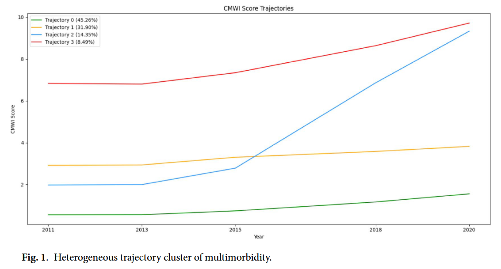
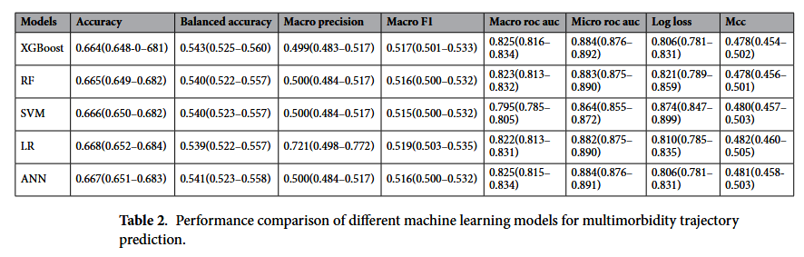
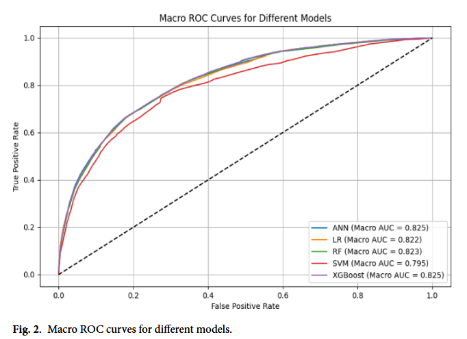
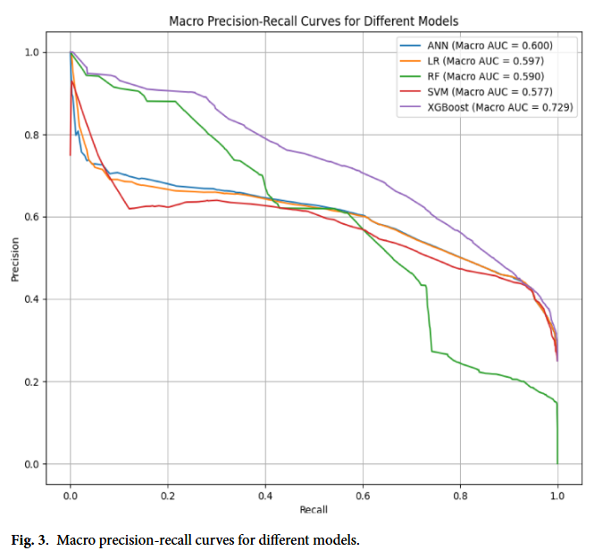

> **Machine learning models for predicting multimorbidity trajectories in middle-aged and elderly adults** ([link](https://www.nature.com/articles/s41598-025-07060-z))  
> Li Yao, Qiaoxing Li, Zihan Zhou, Jiajia Yin, Tingrui Wang, Yan Liu, Qinqin Li, Lu Xiao & Dongliang Yang.    
> Scientific Reports  
> 
{: .paper-info-box }

---

사실 나의 전공과 관련된 논문은 아니다. 다만 학교 수업에서 읽어볼 기회가 생겨 읽게 된 논문이다. 논문의 주요 기여 포인트나, 논리의 흐름 심지어는 논문의 구조 등이 내가 평소 읽던 논문들과는 달라서 참 새로우면서도 신기했다. 여러 분야의 대학원생 (더 나아가 연구자)가 존재할텐데, 서로의 분야가 이렇게까지 달라질 수 있다는 점이 참 흥미로웠다.

## 1. 연구 배경: 왜 다질환(Multimorbidity)의 '궤적'을 봐야 하는가?

**1. 고령화 시대의 새로운 난제, 다질환(Multimorbidity)**  
전 세계적으로 인구 고령화가 가속화되면서, 한 사람이 두 개 이상의 만성 질환을 동시에 앓는 **다질환(Multimorbidity)**이 글로벌 헬스케어의 주요 도전 과제로 떠오르고 있다. 다질환은 단순히 병이 여러 개 있다는 것을 넘어, 환자의 전반적인 건강 상태와 신체 기능을 떨어뜨리고 삶의 질을 심각하게 저하시킨다. 게다가 입원이나 장기 요양이 필요한 경우가 많아 개인과 국가 모두에게 막대한 의료비 부담을 안겨준다. 실제로 중국의 경우 45세 이상 인구의 약 56.7%가 다질환을 겪고 있다는 통계가 있을 정도로 상황은 심각하다.

**2. '스냅샷'이 아닌 '영화'를 봐야 한다**  
이처럼 다질환 관리의 중요성은 커지고 있지만, 기존 연구들에는 분명한 한계가 있었다. 대부분의 연구가 특정 시점에서의 상태만을 딱 잘라 보는 **정적(Static) 평가**에 그쳤다는 점이다. 하지만 우리가 알다시피 만성 질환은 어느 날 갑자기 생겼다가 사라지는 게 아니다. 시간의 흐름에 따라 서서히 진행되고, 질병끼리 상호작용하며 복잡하게 변해가는 **동적(Dynamic)인 과정**이다. 즉, 멈춰 있는 사진(단면 연구)만으로는 환자마다 제각기 다른 질병의 진행 흐름, 즉 **'궤적(Trajectory)'**을 제대로 파악하기 어렵다.

**3. 머신러닝을 통한 궤적 예측과 맞춤형 관리**  
이 논문은 바로 이 지점에 주목했다. 단순히 현재 환자가 어떤 병을 가지고 있는지를 넘어, **시간이 지남에 따라 이들의 건강 상태가 어떤 패턴으로 변화하는지**를 규명하고자 했다. 이를 위해 중국의 대표적인 고령화 데이터인 CHARLS(China Health and Retirement Longitudinal Study)를 활용했고, 방대한 데이터를 효과적으로 분석하기 위해 **시계열 클러스터링**과 **머신러닝 예측 모델**을 도입했다.

결국 이 연구의 목표는 명확하다. 중장년층의 다질환 진행 패턴을 유형별로 나누어 분석하고, 이를 바탕으로 미래의 궤적을 예측하는 것이다. 이렇게 하면 고위험군을 조기에 찾아낼 수 있고, 획일적인 치료가 아닌 각 환자의 궤적에 맞는 **정밀한 맞춤형 건강 관리**가 가능해질 것이다.

## 2. 연구 방법: 시계열 클러스터링과 머신러닝의 결합

### 2.1 연구 설계 및 데이터 출처 (Study Design and Participants)

이 연구는 중국의 중장년층 건강 상태를 모니터링하기 위해 설계된 광범위한 국가 종단 조사인 **CHARLS(China Health and Retirement Longitudinal Study)** 데이터베이스를 활용했다. 이 조사는 중국 내 28개 성(provinces)에 거주하는 45세 이상의 중장년 및 노년층을 주 대상으로 한다.

**1. 표본 추출 및 조사 기간**  
데이터의 대표성을 확보하기 위해 **다단계 층화 확률 비례 추출법(multistage stratified probability sampling method proportional to size)**을 사용했으며, 추적 조사는 2~3년 간격으로 수행되었다. 연구진은 연구의 시간적 범위를 최대한 확장하여 장기적인 궤적을 파악하기 위해, 2011년 1차 조사(Wave 1)부터 2020년 5차 조사(Wave 5)까지의 데이터를 모두 활용했다.

**2. 대상자 선정 기준 (Exclusion Criteria)**  
초기 데이터에서 다음과 같은 기준에 해당하는 참여자는 분석에서 제외했다.
* **기준 연령 미달:** 베이스라인 시점(2011년) 기준으로 45세 미만인 경우.
* **추적 실패:** 2회 연속으로 추적 조사에 참여하지 않은 경우.
* **정보 부족:** 질병 관련 정보가 불완전한 경우.

이러한 선별 과정을 거쳐 최종적으로 **12,198명**의 참여자가 분석 대상으로 확정되었다.

### 2.2 다질환 측정 방법: CMWI (Multimorbidity Assessment)

이 연구에서는 중장년 및 노년층 환자의 다질환 상태를 정량화하기 위해 **CMWI(Chinese Multimorbidity-Weighted Index)**를 사용했다. 이 지표는 본 연구에서 사용하는 CHARLS 데이터베이스를 기반으로 개발되었으며, 여러 만성 질환이 실제 신체 기능(physical functioning)에 미치는 영향을 고려하여 설계되었기 때문에 중국의 중장년층 인구를 평가하는 데 있어 가장 적합한 방법이라 할 수 있다.

**1. 단순 개수 산정 방식과의 차이점**  
단순히 "질병이 몇 개 있는가?"를 세는 질병 개수(disease count) 방식과 비교했을 때, CMWI는 각 질병이 환자의 건강에 미치는 서로 다른 영향력을 훨씬 더 정확하게 반영한다. 이 지표는 총 **14가지 만성 질환**을 포함하며, 각 질환은 신체 기능에 미치는 영향력의 크기에 따라 각기 다른 가중치(weight)를 부여받는다.

**2. 점수 산출 방식 및 주요 가중치**  
최종 CMWI 점수는 환자가 진단받은 모든 질환의 가중치를 합산하여 계산한다. 포함된 14개 질환 중 가중치가 가장 높은 상위 3가지 질환은 다음과 같다.
* **뇌졸중 (Stroke):** 5.1점
* **기억력 관련 질환 (Memory-related conditions):** 4.3점
* **암 (Cancer):** 3.4점

즉, 같은 '1개의 질병'이라도 뇌졸중 환자가 겪는 신체적 부담을 더 크게 평가하여 점수화하는 방식이다.

**3. 시계열 데이터 처리 및 결측치 보정**  
연구진은 각 추적 관찰 시점(Follow-up time point)마다 참여자들의 CMWI 점수를 계산하여 시계열 데이터를 구축했다. 장기간 추적 조사 특성상 중간에 조사가 누락되는 경우가 발생할 수 있는데, 만약 중간 연도에 추적 관찰이 되지 않은(lost to follow-up) 환자가 있다면 **직전 조사 시점(previous follow-up)의 CMWI 점수를 그대로 가져와 대체(imputation)**하는 방식을 택했다. 주목할 점은, 연구 참여자 중 두 번 연속으로 추적 관찰 시점 사이에 데이터가 유실된 사례는 없었다는 것이다(와우..).

### 2.3 궤적 분석: DTW 기반 시계열 클러스터링 (Trajectory Analysis)

이 연구의 핵심은 환자마다 제각기 다른 다질환 지수(CMWI)의 변화 패턴을 어떻게 그룹화했느냐에 있다. 이를 위해 연구진은 **[DTW(Dynamic Time Warping)](https://rtavenar.github.io/blog/dtw.html) 기반의 Time-series K-means Clustering** 기법을 적용했다.

**1. 왜 DTW인가?**  
시계열 데이터 분석에서 가장 중요한 것은 '유사성'을 어떻게 정의하느냐다. 이 연구에서는 DTW를 거리 측정(Distance Metric) 도구로 채택했다. DTW는 시계열 데이터의 길이가 다르거나 시간축의 왜곡이 있어도 파형의 형태적 유사성을 아주 잘 잡아내는 알고리즘이다. 덕분에 시간이 지남에 따라 변하는 다질환 지수의 역동적인 구조와 패턴을 효과적으로 드러낼 수 있었다.

**2. 클러스터링 과정 및 최적화 (Process & Optimization)**  
알고리즘의 작동 방식은 일반적인 K-means와 유사하다. 임의의 중심점(Centroid)을 설정하고, DTW 거리를 기준으로 데이터를 할당한 뒤 중심점을 갱신하는 과정을 수렴할 때까지 반복한다. 연구진은 모델의 성능을 끌어올리기 위해 **Grid Search**를 활용했다. 이를 통해 DTW 윈도우 파라미터 등을 튜닝하여 클러스터 내부의 분산을 최소화하고 성능을 최적화했다.

> 파라미터 공개는 따로 안 한 듯 하다.. 음..

**3. 최적의 K값 선정 (Determining K)**  
몇 개의 그룹으로 나누는 것이 가장 좋을까? 이 연구는 하나의 지표에만 의존하지 않고, 다음 세 가지 기준을 종합적으로 평가하여 최적의 클러스터 수($K$)를 결정했다.
* **Elbow plot (SSE):** 오차 제곱합의 감소 추세를 확인.
* **Silhouette Coefficient (SC):** 클러스터 내 응집도와 간격 분리도를 평가.
* **Krzanowski-Lai (KL) index:** 클러스터 구조의 품질을 평가하는 지수.

**4. 모델 성능 평가 지표 (Evaluation Metrics)**  
구축된 궤적 모델이 얼마나 타당한지 검증하기 위해 매우 다양한 정량적 지표들이 동원되었다.
* **모델 복잡도 및 적합성:** aAIC, aBIC (값이 낮을수록 과적합 없이 균형 잡힌 모델).
* **응집도 및 분리도:** SSE(낮을수록 좋음), SC(-1~1 사이, 1에 가까울수록 좋음), 평균 클러스터 내/간 거리.
* **구조적 성능:** DB index(낮을수록 좋음), VarExp(데이터 설명력, 높을수록 좋음).

**5. 실용적 제약 조건**  
단순히 수학적으로 잘 나뉜 것뿐만 아니라, 현실적인 의미도 고려했다. 통계적 편향을 막기 위해 각 궤적 그룹이 전체 표본의 최소 **5%** 이상을 차지하도록 제한했으며, 도출된 그룹이 임상적으로 명확한 의미를 가질 수 있는지(Clinical Significance)를 중요하게 판단했다.

---

### 2.4 입력 변수 및 전처리 (Input Variables)

예측 모델에 들어갈 입력 변수(Input Variables)는 선행 문헌과 전문가의 판단을 근거로 선정되었다. 2011년 기준(Baseline)의 개인적 특성, 생활 습관, 사회경제적 지위, 신체 기능 등을 포괄적으로 수집했다.

주요 변수 카테고리는 다음과 같다:
* **사회인구학적 변수:** 연령, 성별, 교육 수준, 결혼 상태 등.
* **생활 습관:** 흡연, 음주, 식습관 등.
* **사회경제적 지위:** 고용 상태, 주거 형태 등.
* **신체 기능 (Physical Function):** 특히 **일상생활 수행능력(ADL)**은 20개 항목(달리기, 걷기, 물건 들기 등)을 자가 진단하여 점수화했다. 점수에 따라 3단계(Level 1~3)로 분류하여 분석 편의성을 높였다. 그 외 BMI, 보행 속도, 악력 등이 포함된다.
* **기타:** 의료 이용, 돌봄 행위 제공 여부, 자가 평가 건강 상태(기대 수명, 삶의 만족도 등).

데이터 전처리 과정에서 **결측치(Missing Values)** 문제는 다중 대체법(Multiple Imputation, 5회 수행)을 사용하여 해결했다. 이를 통해 불완전한 데이터로 인한 편향(Bias)을 줄이고 모델의 신뢰성을 확보했다.

### 2.5 XGBoost를 이용한 변수 선택 (Feature Selection)

모델의 효율성을 높이기 위해 모든 변수를 다 쓰는 대신, **XGBoost** 알고리즘을 활용하여 핵심 변수를 선별했다.

**왜 XGBoost를 썼을까?**
XGBoost는 대용량 데이터를 처리하는 데 효율적이며, 비선형 문제를 잘 다루는 GBDT(Gradient Boosting Decision Tree) 모델이다. 특히 모델 자체적으로 **변수 중요도(Feature Importance)**를 산출할 수 있어, 어떤 변수가 예측에 중요한지 파악하기 용이하다.

**선택 과정:**
1.  모든 변수를 넣고 XGBoost를 학습시켜 변수 중요도를 계산한다.
2.  중요도가 높은 순서대로 변수를 정렬한다.
3.  변수를 하나씩 추가해가며 10-fold 교차 검증(Cross-validation)을 수행한다.
4.  다중 클래스 **ROC-AUC** 값이 가장 높은 최적의 변수 조합(Optimal Feature Subset)을 최종 선택한다.

이렇게 선택된 최적의 변수들은 이후 다른 머신러닝 모델(RF, SVM 등)을 학습시키는 데에도 공통적으로 사용되었다.

### 2.6 예측 모델 개발 및 평가 (Predictive Model Development & Evaluation)

최적의 변수(Feature)들을 선정했다면, 이제 본격적으로 다질환 궤적을 예측하는 모델을 만들 차례다. 이 연구에서는 총 5가지의 대표적인 머신러닝 알고리즘을 사용하여 모델을 구축하고, 그 성능을 다각도로 비교 분석했다.

#### 1) 사용된 5가지 머신러닝 알고리즘
연구진은 각 알고리즘이 가진 고유한 장점을 활용하기 위해 다음과 같은 모델들을 선정했다.

* **XGBoost:** 그래디언트 부스팅(Gradient Boosting) 기반의 트리 모델이다. 변수 간의 비선형 관계를 잘 학습하며, 특히 클래스 불균형(Class Imbalance) 문제를 해결하는 데 강점이 있다. 강력한 트리(Strong trees)를 만드는 데 집중하여 예측의 편향(Bias)을 최소화한다.
* **Random Forest (RF):** 앙상블 학습(Ensemble Learning)의 대표주자다. 여러 개의 결정 트리(Decision Tree)를 만들고 다수결 투표(Majority Voting)를 통해 결론을 내린다. 이 과정에서 모델의 분산(Variance)을 효과적으로 줄여준다.
* **SVM (Support Vector Machine):** 고차원 공간에서 데이터를 잘 분류하며, 복잡한 결정 경계(Boundary)를 가진 문제에 적합하다.
* **Logistic Regression (LR):** 가장 기본적이고 해석이 쉬운 모델로, 데이터가 선형적으로 분리 가능할 때 이상적이다.
* **ANN (Artificial Neural Network):** 강력한 비선형 적합(Nonlinear fitting) 능력을 가지고 있어, 변수들 간의 복잡한 관계를 포착하는 데 유리하다.

#### 2) 학습 전략 (Training Strategy)
데이터셋은 무작위로 **학습용(Training set, 75%)**과 **테스트용(Test set, 25%)**으로 나누어 진행했다.
* **교차 검증 (Cross-Validation):** 모델의 일반화 성능을 확보하고 안정성을 높이기 위해 10-fold Cross-validation을 수행했다.
* **하이퍼파라미터 튜닝:** Grid Search를 사용하여 각 모델의 성능을 극대화할 수 있는 최적의 파라미터 조합을 탐색했다.

#### 3) 성능 평가 지표 (Evaluation Metrics)
의료 데이터 특성상 클래스 불균형(Class Imbalance)이 존재할 가능성이 높다. 따라서 단순히 '정확도(Accuracy)' 하나만 보는 것은 위험하다. 이 연구에서는 모델의 분류 능력을 종합적으로 평가하기 위해 다양한 지표를 도입했다.

* **Accuracy & Balanced Accuracy:** 전체적인 정답률뿐만 아니라, 불균형을 보정한 평균 성능도 함께 확인했다.
* **Log Loss:** 모델이 정답을 맞혔더라도, 그 예측 확률의 불확실성까지 고려하여 오답에 대해 더 큰 페널티를 부여하는 지표다. 모델의 세밀한 성능을 파악하는 데 도움을 준다.
* **Macro Precision & Macro F1:** 각 클래스별 정밀도(Precision)와 재현율(Recall)의 조화 평균을 평가한다.
* **ROC-AUC (Macro & Micro):** Macro 방식은 각 클래스의 변별력을, Micro 방식은 전체적인 성능을 고려하여 평가한다.
* **MCC (Matthews Correlation Coefficient):** True/False Positive와 Negative를 모두 고려하는 지표로, 클래스 분포가 불균형할 때도 모델을 공정하게 평가할 수 있는 강력한 척도다.

추가적으로, **ROC-AUC 곡선**과 **Precision-Recall 곡선**을 시각화하여 모델 성능을 직관적으로 제시했으며, **[SHAP (SHapley Additive exPlanations)](https://arxiv.org/abs/1705.07874)** 분석을 통해 어떤 변수가 예측에 중요한 역할을 했는지 설명 가능성(Interpretability)을 확보했다.

### 2.7 통계 분석 및 도구 (Statistical Analysis)

이 연구의 핵심 분석 과정은 크게 세 단계로 나눌 수 있다.

1.  **1단계 (Clustering):** 시계열 K-means 알고리즘을 활용하여 환자들의 다질환 궤적을 유형별로 클러스터링했다.
2.  **2단계 (Feature Selection):** XGBoost 모델을 적용하여 궤적 예측에 가장 중요한 변수들을 선별했다.
3.  **3단계 (Prediction & Explanation):** 선별된 최적의 변수들을 5가지 머신러닝 모델에 학습시켜 궤적을 예측하고, SHAP 분석을 통해 결과에 영향을 미친 주요 요인을 해석했다.

**통계 검정 방법:**  
데이터의 성격에 따라 다음과 같은 통계적 검정 방법을 적용했다.
* **연속형 변수:** 평균 ± 표준편차로 기술하며, 그룹 간 차이는 **일원배치 분산분석(ANOVA)**으로 확인했다.
* **범주형 변수:** 백분율(%)로 표시하며, **카이제곱 검정(Chi-square test)**을 사용했다.
* **순서형 변수:** **순위합 검정(Rank-sum test)**을 통해 비교 분석했다.
* 모든 통계적 유의성은 양측 검정 기준 P-value < 0.05로 설정했다.

**분석 환경:**  
모든 분석은 **Python 3.11**을 기반으로 수행되었으며, 데이터 분석과 머신러닝을 위해 `Scikit-learn`, `XGBoost`, `SHAP`, `Pandas`, `NumPy` 라이브러리를 활용했다(오.. 이런것도 적는다..).

## 3. 연구 결과: 4가지의 다질환 진행 궤적 (Results)

시계열 클러스터링(Time-series K-means)을 수행한 결과, 환자들의 다질환 진행 패턴은 크게 **4가지 유형**으로 나뉘는 것으로 나타났다.

### 3.1 최적의 클러스터 수 결정 ($K=4$)
연구진은 Elbow method(SSE), Silhouette Coefficient(SC), KL index 등을 종합적으로 고려하여 최적의 클러스터 개수($K$)를 4개로 확정했다. 클러스터 개수를 4개로 설정했을 때 오차 제곱합(SSE)의 감소폭이 완만해지기 시작했고, SC와 KL 지수가 가장 높게 나타나 군집 간 분리가 가장 잘 일어났기 때문이다. 설명력(VarExp)이 0.703에 달하고, aAIC와 aBIC 수치 또한 4개일 때 가장 이상적인 균형을 보였다.

### 3.2 4가지 궤적 유형 (Trajectory Groups)
도출된 4가지 그룹은 CMWI(다질환 가중 지수) 점수의 시간적 변화 양상에 따라 다음과 같이 명명되었다. (Figure 1 참조)

1.  **안정적 저위험군 (Stable Low-Risk Group, 45.26%)**
    * 전체의 약 절반(5,521명)을 차지하는 가장 큰 그룹이다.
    * 연구 기간 내내 다질환 점수가 낮고 안정적인 상태를 유지한다.

2.  **점진적 악화군 (Progressively Worsening Group, 14.35%)**
    * 약 1,750명이 속한다.
    * 초기에는 점수가 낮았으나 시간이 지날수록 상태가 서서히 나빠지는 패턴을 보인다. "시계열 분석"을 하지 않았다면 단순 저위험군으로 오해할 수 있는, 예방적 개입이 시급한 그룹이다.

3.  **중등도 안정군 (Moderate Stability Group, 31.90%)**
    * 약 3,891명이 속하며 두 번째로 큰 그룹이다.
    * 어느 정도의 만성 질환을 가지고 있지만, 급격한 악화 없이 중간 수준에서 상태가 유지된다.

4.  **지속적 악화군 (Consistently Deteriorating Group, 8.49%)**
    * 약 1,036명으로 비중은 가장 적지만 임상적으로 가장 위험한 그룹이다.
    * 초기부터 다질환 점수가 높았으며, 시간이 지날수록 더욱 가파르게 건강이 악화되는 경향을 보인다.

이 결과는 모든 중장년층 환자를 똑같이 관리해서는 안 된다는 것을 시사한다. 사람마다 병이 깊어지는 속도와 패턴(Heterogeneity)이 다르기 때문에, 각 궤적에 맞는 차별화된 전략이 필요함을 데이터를 통해 증명한 것이다.

### 3.3 그룹별 기저 특성 비교 (Baseline Characteristics)

도출된 4가지 궤적 그룹은 단순히 질병 점수만 다른 것이 아니었다. 연령, 성별, 교육 수준, 결혼 여부, 생활 습관 등 **기저 특성(Baseline Characteristics)**에서도 통계적으로 유의미한 차이($p < 0.05$)를 보였다. 각 그룹이 어떤 특징을 가진 사람들로 구성되어 있는지 살펴보자.

**1. 인구통계학적 특성 (Demographics)**
* **연령:** 예상대로 '안정적 저위험군'은 45~59세의 비교적 젊은 층 비율(69.4%)이 가장 높았다. 반면, 상태가 가장 나쁜 '지속적 악화군'은 60~79세 노년층 비율(54.1%)이 가장 높았다.
* **성별:** '지속적 악화군'에서 여성의 비율이 58.3%로 가장 높게 나타났다.
* **결혼 상태:** '안정적 저위험군'은 기혼자 비율(92.3%)이 압도적으로 높았으나, '지속적 악화군'은 이혼, 사별, 독신 등의 비율(13.9%)이 상대적으로 높았다. 이는 가족의 돌봄이나 사회적 지지가 건강 유지에 중요한 역할을 할 수 있음을 시사한다.

**2. 사회경제적 지위 및 생활 습관 (SES & Lifestyle)**
* **교육 수준:** 흥미로운 점은 시간이 갈수록 상태가 나빠지는 '점진적 악화군'에서 문맹률(29.8%)이 가장 높게 나타났다는 것이다.
* **흡연 및 음주:** '안정적 저위험군'은 비흡연(60.0%) 및 비음주(87.7%) 비율이 가장 높았다. 건강한 생활 습관이 다질환 궤적을 안정적으로 유지하는 데 기여함을 알 수 있다.

**3. 건강 상태 (Health Status)**
가장 위험한 그룹인 **'지속적 악화군'**은 기저 시점(2011년)부터 이미 건강 지표가 매우 좋지 않았다.
* **자가 평가 건강:** 본인의 건강이 "나쁘다" 또는 "매우 나쁘다"고 응답한 비율이 각각 55.6%, 7.8%로 다른 그룹보다 월등히 높았다.
* **질병 부담:** 평균 질병 개수가 약 4.05개($\pm 1.25$)로 가장 많았고, 낙상 경험(27.0%)이나 장애 보유율(7.3%) 또한 가장 높았다.

결과적으로 다질환의 진행 궤적은 우연히 결정되는 것이 아니라 나이, 사회경제적 환경, 생활 습관, 그리고 초기 건강 상태가 복합적으로 작용한 결과임을 알 수 있다. 특히 연구진은 **'점진적 악화군'**이 다른 그룹과 비교했을 때 우울 증상이나 자가 건강 평가 등에서 뚜렷한 차이를 보인다는 점을 발견했는데, 이는 해당 그룹에 대한 조기 개입이 중요함을 시사한다.

### 3.4 예측 모델 성능 평가 및 핵심 변수 (Model Performance)

머신러닝 모델을 통해 다질환 궤적을 예측한 결과, 어떤 요인이 중요했고 어떤 알고리즘이 가장 우수한 성능을 보였는지 살펴보자.

**1. 핵심 예측 변수 3가지 (Key Features)**  
XGBoost 알고리즘을 활용해 수많은 입력 변수 중 모델 성능 최적화에 기여하는 **3가지 핵심 변수**를 선별해냈다.
* **자가 평가 건강 상태 (Self-rated health status)**
* **ADL 자가 평가 점수 (ADL self-rating)**
* **기저 질환 개수 (Baseline disease counts)**

이 3가지 변수는 나중에 SHAP 분석에서도 궤적을 결정짓는 가장 영향력 있는 요인으로 재확인되었다. 즉, 환자가 스스로 느끼는 건강 상태와 일상생활 수행 능력, 그리고 현재 앓고 있는 질병의 수가 미래의 건강 궤적을 예측하는 데 결정적이라는 뜻이다.

**2. 모델별 성능 비교 (Performance Comparison)**  
선별된 변수를 바탕으로 5가지 머신러닝 모델(XGBoost, RF, SVM, LR, ANN)의 성능을 비교 분석했다.

  

    
    
Fig 2. Macro ROC curves

  

  

    
    
Fig 3. Macro Precision-Recall curves

  

* **XGBoost (Best Performer):** 전반적으로 가장 우수한 성능을 보였다. 정확도(Accuracy)는 **0.664**, Micro ROC-AUC는 **0.884**를 기록하며 뛰어난 예측력을 입증했다. 또한 Log Loss(0.806) 역시 낮게 나타나 예측 확률의 신뢰도도 높았다.
* **Random Forest (RF) & ANN:** XGBoost와 매우 유사한 성능을 보였다. 특히 Micro ROC-AUC가 각각 0.883, 0.884로 나타나 다질환 궤적 예측에 충분히 활용 가능하다는 것을 보여주었다.
* **Logistic Regression (LR):** 눈여겨볼 점은 LR 모델이 **Macro Precision(0.721)**에서 가장 높은 점수를 기록했다는 것이다. 이는 정밀도가 중요한 상황에서는 간단한 LR 모델도 강력한 도구가 될 수 있음을 시사한다.
* **SVM:** 정확도와 ROC-AUC 측면에서는 다른 모델보다 약간 낮았으나(Micro ROC-AUC 0.864), Log Loss와 MCC 지표에서는 여전히 안정적인 성능을 유지했다. 

결론적으로 XGBoost, RF, ANN 등 머신러닝 방법론들이 다질환 궤적을 예측하는 데 있어 높은 적용 가능성(Good applicability)을 가지고 있음을 확인할 수 있다.

### 3.5 모델 해석: SHAP을 통한 예측 요인 분석 (Interpretability Analysis)

모델이 단순히 예측만 잘하는 것으로는 부족하다. 왜 그런 예측을 했는지 이해해야 실제 의료 현장에 적용할 수 있기 때문이다. 연구진은 **SHAP (SHapley Additive exPlanations)** 분석을 통해 XGBoost와 Random Forest(RF) 모델의 예측 결과를 정량적으로 해석했다.

**1. 3대 핵심 예측 변수 (Top 3 Key Features)**  
SHAP 값의 분포를 분석한 결과, 앞서 변수 선택 과정에서 뽑힌 3가지 변수가 실제로도 궤적 예측에 가장 큰 영향을 미치는 것으로 나타났다.

* **기저 질환 개수 (Baseline disease counts)**
* **자가 평가 건강 상태 (Self-rated health status)**
* **ADL 자가 평가 점수 (ADL self-rated score)**

XGBoost와 RF 모델 모두에서 이 세 변수의 영향력은 일관되게 나타났으며, 특히 **질환 개수**와 **건강 상태**가 가장 결정적인 역할을 했다.

**2. 궤적 그룹별 결정 요인 (Feature Impact by Trajectory)**  
각 그룹으로 분류되는 데 있어 변수들이 어떻게 작용했는지 구체적인 방향성(Direction)을 살펴보자.

* **안정적 저위험군 (Stable Low-Risk):**
    * 질병 개수가 적고, 자가 평가 건강 상태가 좋으며(점수가 낮음), 자가 관리 능력(ADL)이 높을수록(점수가 낮음) 이 그룹으로 예측될 확률이 높았다.
* **지속적 악화군 (Consistently Deteriorating):**
    * 반대로 질병 개수가 많고, 건강 상태가 나쁘며(점수가 높음), 자가 관리 능력이 떨어질수록(점수가 높음) 이 그룹에 속할 가능성이 컸다.
* **점진적 악화군 (Progressively Worsening):**
    * 이 그룹은 '건강 상태가 나쁨'이 주요한 예측 요인이었다.
    * 질병 개수가 늘어나고 건강 상태가 나빠질수록 이 그룹으로 예측되는 경향이 있었으나, 질병 개수의 영향력은 다소 변동적(fluctuating)인 모습을 보였다. 이는 해당 그룹 내에서 초기 질병 개수의 불안정성을 시사한다.
* **중등도 안정군 (Moderate Stability):**
    * 세 가지 핵심 변수의 영향력이 일정한 방향 없이 변동하는 패턴을 보였다. 이는 변수들 간의 복잡한 상호작용이 작용하고 있음을 의미한다.

**3. 추가 분석 (Extended Analysis)**  
연구진은 최종 모델에 포함되지 않은 상위 20개 변수에 대해서도 SHAP 분석을 수행하여, 잠재적인 영향 요인들을 폭넓게 탐색했다. 이는 비록 모델의 정확도를 위해 제외되었더라도, 임상적으로 의미 있을 수 있는 다른 요인들을 놓치지 않으려는 시도라 할 수 있다.

## 4. Discussion: 시계열 분석이 던지는 시사점

이번 연구를 통해 밝혀진 4가지의 다질환 진행 궤적은 단순한 패턴 분류 이상의 의미를 갖는다. 분석 결과를 바탕으로 이 연구가 가지는 학술적, 임상적 가치를 정리해 보자.

### 4.1 궤적의 이질성과 생물학적 요인  
연구 결과 확인된 4가지 궤적(안정적 저위험군, 점진적 악화군, 중등도 안정군, 지속적 악화군)은 환자마다 병의 진행 양상이 얼마나 다른지(Heterogeneity)를 보여준다. 특히 주목할 점은 연령에 따른 차이다. '안정적 저위험군'은 주로 45~59세의 중년층인 반면, '지속적 악화군'은 60~79세 노년층이 주를 이뤘다. 이는 노화에 따른 면역 및 대사 기능의 저하가 만성 질환의 공존과 악화를 가속화시키는 주요 원인임을 시사한다.

### 4.2 머신러닝의 예측 능력 입증  
다질환 궤적을 예측하기 위해 5가지 머신러닝 모델을 비교한 결과, XGBoost가 가장 뛰어난 성능(Micro ROC-AUC 0.884)을 보였다. 물론 RF나 ANN 같은 다른 모델들도 준수한 성능을 기록했다. 이는 머신러닝이 복잡한 다질환 데이터를 분석하고 미래를 예측하는 데 있어 매우 실용적인 도구가 될 수 있음을 증명한다.

### 4.3 무엇이 궤적을 결정하는가? (Key Predictors)  
모델의 해석(Interpretability) 과정에서 **기저 질환 개수**, **ADL(일상생활 수행능력) 점수**, **자가 평가 건강 상태**가 가장 중요한 예측 인자로 지목되었다.
* **질환 자체보다 기능이 중요:** 병이 몇 개인지도 중요하지만, 환자가 '스스로 생활할 수 있는가(ADL)'와 '자신의 건강을 어떻게 생각하는가(Self-rated health)'가 고위험 궤적을 예측하는 데 결정적이다.
* **주관적 지표의 가치:** 환자의 주관적인 건강 평가는 실제 질병 부담과 삶의 고충을 포괄적으로 반영하는 지표로, 치료 순응도와도 직결된다.

### 4.4 정적 분석에서 동적 분석으로의 전환  
기존의 많은 연구들은 특정 시점의 상태만 보는 단면적(Cross-sectional) 분석에 그쳐, 질병이 시간에 따라 어떻게 변하는지(Dynamic nature)를 놓치는 경우가 많았다. 하지만 이 연구는 시계열 클러스터링을 도입하여 시간의 흐름에 따른 질병의 역동성을 포착했다는 점에서 기존 연구와 차별화된다. 또한 중국인에게 특화된 CMWI 지표를 활용함으로써 지역적 특성을 반영한 정밀한 분석을 수행했다.

### 4.5 임상 및 공중보건학적 의의  
이 연구 결과는 실제 의료 현장에 즉각적으로 적용 가능한 중요한 시사점을 준다.
1.  **조기 개입:** '점진적 악화군'이나 '지속적 악화군'에 속할 것으로 예측되는 환자를 조기에 선별하여 개입함으로써 질병 진행을 늦추고 의료비를 절감할 수 있다.
2.  **간편한 스크리닝:** 예측에 사용된 핵심 변수(자가 평가 건강, ADL 등)는 임상 현장에서 설문만으로도 쉽게 얻을 수 있는 데이터다. 복잡한 검사 없이도 고위험군을 빠르게 식별할 수 있다는 뜻이다.
3.  **정밀 의료 (Precision Medicine):** 환자의 궤적 유형에 따라 맞춤형 관리 전략을 수립하는 진정한 의미의 정밀 의료를 실현할 수 있는 근거를 마련했다.

### 4.5. 한계점 (Limitations)

이 연구는 다질환 궤적 예측에 새로운 시각을 제시했지만, 몇 가지 한계점 또한 존재한다.

1.  **일반화의 한계 (Generalizability):** 중국의 CHARLS 데이터만을 사용했기 때문에, 연구 결과를 다른 국가나 인종에게 그대로 적용하기에는 무리가 있을 수 있다.
2.  **지표의 지역성 (Adaptability of CMWI):** 사용된 CMWI(중국형 다질환 가중 지수)는 중국인에게 최적화된 지표다. 다른 지역에서 이 연구 방법론을 적용하려면 해당 인구 집단에 맞게 지표를 수정해야 할 필요가 있다.
3.  **결측치 처리 방식 (Imputation Method):** 시계열 데이터의 빈값을 채울 때, 단순히 이전 시점의 데이터를 가져오는 방식(Previous follow-up wave)을 사용했다. 이는 특정 시점에 발생했을지 모르는 개인의 미세한 건강 변화(Fluctuations)를 놓칠 위험이 있다.

## 5. 결론 (Conclusions)

이 연구는 **시계열 클러스터링**과 **머신러닝**을 결합하여 중장년층의 다질환 진행 궤적을 규명한 의미 있는 시도였다.

연구를 통해 **4가지의 뚜렷한 질병 진행 패턴**을 발견했으며, XGBoost 알고리즘을 통해 궤적을 결정짓는 핵심 예측 인자들을 심층적으로 분석했다. 이러한 결과는 획일적인 치료가 아닌, 만성 질환의 **개인 맞춤형 관리(Personalized Management)**를 위한 과학적 근거를 제공한다.

결과적으로 이 연구는 고령화 시대의 핵심 과제인 다질환 관리에 있어, 임상적 개입 전략을 최적화하고 **정밀 보건(Precision Health)**을 앞당기는 데 기여할 수 있는 실증적 토대를 마련했다는 점에서 큰 의의가 있다. 

## 6. 나의 생각

### 6.1. CS 분야와 의료 분야의 "Contribution"의 정의가 다르다.

CS 분야에서의 contribution이라면, 주로 새로운 알고리즘 제안, 기존 SOTA보다의 성능 향상 혹은 수학적/이론적 최적화가 핵심이다. 데이터에 대한 분석은 보통 실험 검증용이지 그 자체가 contribution이 되지 못한다.

반면, 이 논문에서는 오히려 알고리즘 등이 도구일 뿐, 핵심은 데이터에서 어떤 통계적 특성을 발견했다는 데에 있다. 정리하자면 이런 보건/의료 분야에서는, "어떤 데이터에 기존의 기술을 적용해서 새로운 의학적/보건학적 insight를 도출했다"가 가장 큰 contribution이 되는 것 같다.

### 6.2. 내가 들었던 궁금증, K-means로 라벨링 한 뒤에, 그 라벨을 예측하는 모델을 만든 이유?

논문을 읽고 처음 들었던 궁금증이였다.

> "K-means로 군집화 한 뒤에, 그 라벨을 예측하는 모델을 만든 이유가 뭐지?"

사실 K-means를 사용했다는 것은, 어떤 군집의 기준점을 알고 있다는 소리이다. 그렇다면, 굳이 예측 모델이 없어도, 내가 알고 있는 어떤 군집의 기준점을 기반으로 절대적인(해석적인, 거의 100%의 정확도를 가진) 분류기를 만들 수 있었을 것이다. 아니 애초에, 굳이 ML을 이용하는 이유가 뭐지?

곰곰히 생각해본 결과, "새로운 환자가 들어왔을 때, 그 환자가 어떤 군집에 속할지 미리 예측하고 싶어서"가 내 질문에 대한 답인 것 같다. 우리가 라벨링을 사용할 때 사용한 데이터는 2011년 ~ 2020년까지의 10년치 시계열 데이터를 가지고 있었다. 하지만, 새로운 환자가 들어왔을 때 그 환자에게 "10년동안의 데이터가 쌓일 때까지 기다리세요." 라고 할 수는 없지 않은가? 즉, 우리는 어떤 예측 모델을 만들어두고, 그 모델이 새로운 환자의 초기 데이터(예: 2011년 데이터)만 가지고도, 그 환자가 어떤 군집에 속할지 미리 예측할 수 있어야 한다. 이러한 이유 때문에 K-means로 라벨링 한 뒤에, 그 라벨을 예측하는 모델을 만든 것이 아닐까 싶다.