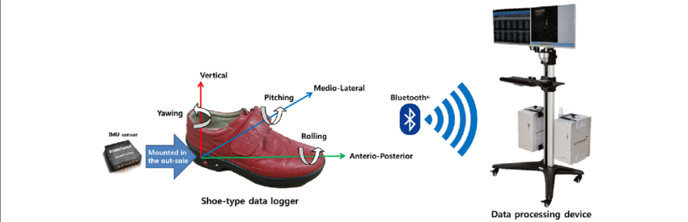
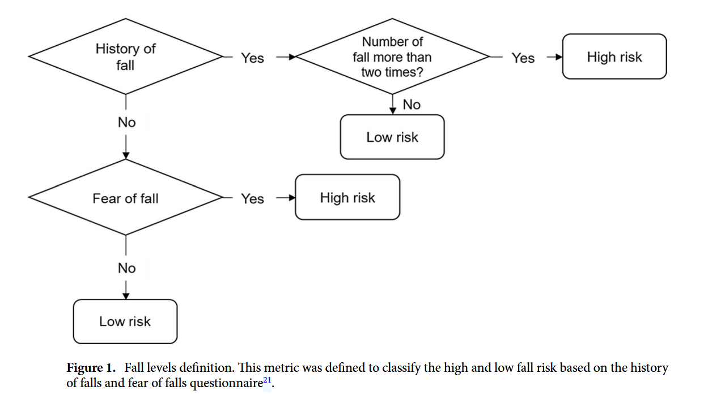
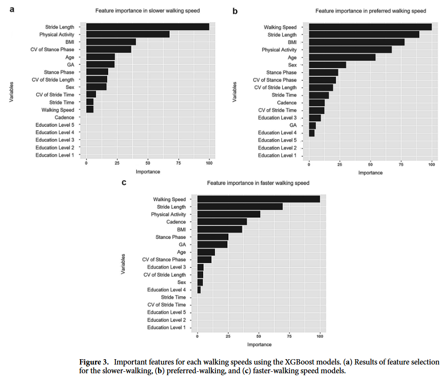
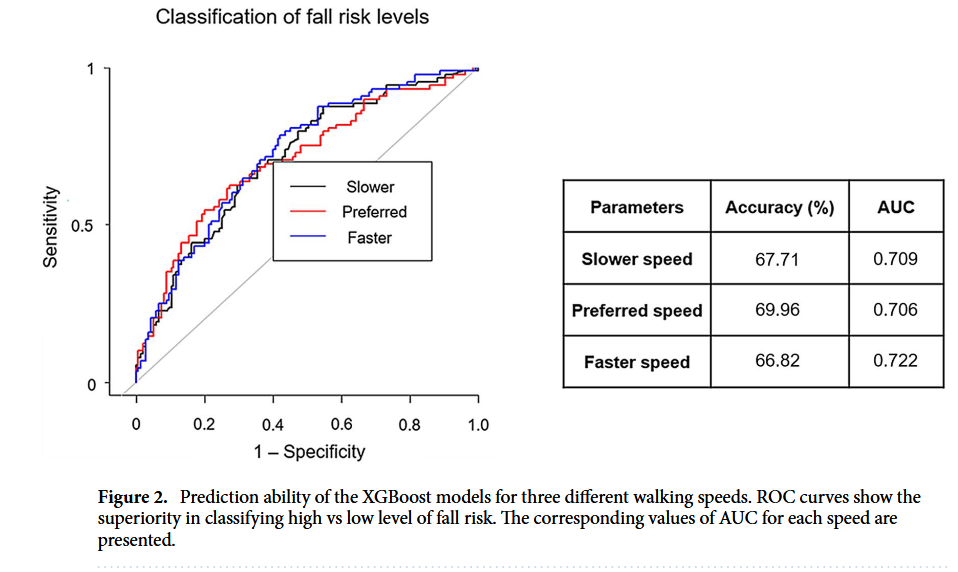

> **XGBoost based machine learning approach to predict the risk of fall in older adults using gait outcomes** ([link](https://www.nature.com/articles/s41598-021-91797-w))  
> Byungjoo Noh, Changhong Youm, Eunkyoung Goh, Myeounggon Lee, Hwayoung Park, Hyojeong Jeon & OhYoen Kim.  
> Scientific Reports  
> 
{: .paper-info-box }

---

## 1. 연구 배경: 노인 낙상, '보행 데이터'로 예측할 수 없을까?

### 1.1 침묵의 살인자, 낙상 (Falls)
노년층에게 낙상은 단순한 사고가 아니다. 심각한 부상은 물론, 건강 악화와 사망으로까지 이어질 수 있는 가장 흔한 원인 중 하나다. 많은 선행 연구들이 지적하듯, 낙상은 고령, 인지 기능 저하, 근력 감소 등 다양한 요인과 관련이 있지만, 그중에서도 가장 결정적인 위험 인자는 바로 **'보행 이상(Gait abnormalities)'**이다.

나이가 들면 걷는 속도가 느려지고, 보폭이 짧아지며, 걸음걸이가 불규칙해지는데, 이러한 변화는 신체 기능 저하를 의미함과 동시에 낙상으로 이어지는 직접적인 원인이 된다. 따라서 보행 패턴을 분석해서 낙상 위험을 미리 예측할 수 있다면 사고를 예방하는 데 큰 도움이 될 것이다.

### 1.2 기존 연구의 한계점: "너무 짧게 걷고, 제대로 예측하지 못했다"
하지만 기존 연구들에는 몇 가지 아쉬운 점이 있었다.
1.  **데이터의 한계:** 대부분 'Timed Up and Go' 테스트처럼 짧은 구간을 걷는 데이터만 사용했다. 몇 걸음 안 되는 데이터로는 실제 생활에서의 연속적인 보행 패턴을 완벽히 반영하기 어렵다.
2.  **분석 모델의 한계:** SVM이나 인공신경망(ANN)을 이용한 연구들이 있었지만, 이들은 주로 균형 문제(Balancing problem)를 구별하는 데 그치거나, 낙상을 예측하더라도 '어떤 보행 변수가 중요한지(Essential gait parameters)'를 명확히 뽑아내지 못했다.

### 1.3 해결책: IMU 센서와 XGBoost의 만남
이 논문은 이러한 한계를 극복하기 위해 **IMU(관성 측정 장치) 센서**와 **XGBoost(Extreme Gradient Boosting)** 알고리즘을 도입했다.

* **IMU 센서:** 연구실 밖에서도 저비용으로 **연속적이고 긴 시간(Continuative state)**의 보행 데이터를 수집할 수 있어 데이터의 신뢰도를 높여준다. 
* **XGBoost:** 결정 트리(Decision Tree) 기반의 앙상블 모델로, 잔차(Residuals)를 최소화하며 강력한 예측 성능을 보여준다. 특히, 이 연구에서는 단순히 낙상 여부만 분류하는 것이 아니라, **어떤 시공간적 보행 변수(Spatiotemporal gait parameters)가 낙상 위험에 가장 큰 영향을 미치는지** '최적의 특징(Optimal Features)'을 추출해내는 데 집중했다.

결국 이 연구의 목표는 명확하다. 다양한 속도로 걷는 테스트를 통해, **XGBoost로 노인들의 낙상 위험 등급을 정확히 예측하고, 이를 결정짓는 핵심 보행 인자를 찾아내는 것**이다.

## 2. 연구 방법 (Methods)

### 2.1 연구 참여자: 부산에 거주하는 746명의 어르신들

연구진은 부산광역시의 커뮤니티 조사를 통해 대규모의 연구 참여자를 모집했다(한국이라니.. 정겹다..). 연구에 참여한 인원은 총 **746명**으로, 연령대는 63세에서 89세까지 다양하게 분포되어 있다.

정확한 보행 데이터를 얻기 위해 연구진은 엄격한 제외 기준(Exclusion criteria)을 적용했다.
1. 보조 도구 없이 혼자 걷지 못하는 경우
2. 최근 6개월 이내에 근골격계 부상을 입었거나 신경 생리학적 문제가 있었던 경우

는 대상에서 제외했다. 즉, 낙상 위험을 예측하기 위해 순수하게 자력으로 보행이 가능한 노인들의 데이터만을 수집하여 분석의 정확도를 높이고자 했다.

모든 연구 절차는 참여자들의 동의 하에 진행되었으며, 동아대학교 생명윤리위원회(IRB)의 승인을 받아 윤리적 가이드라인을 준수했다.

### 2.2 측정 장비: 신발에 숨겨진 IMU 센서 (Instrumentation)

이 연구의 핵심은 실험실 밖에서도 자연스러운 보행을 측정할 수 있는 웨어러블 장비를 사용했다는 점이다.

**1. 신발형 데이터 로거 (Shoe-type Data Loggers)**  
연구진은 보행 분석 시스템(DynaStab, JEIOS)을 활용했는데, 여기에는 **'Smart Balance SB-1'**이라는 신발 형태의 데이터 로거가 포함된다. 참여자들은 자신의 발 크기에 맞는 신발을 착용하고 테스트를 진행했다.

**2. IMU 센서 사양 (Sensor Specifications)**  
이 신발의 양쪽 밑창(Outsoles)에는 **IMU 센서(IMU-3000, InvenSense)**가 내장되어 있다. 이 센서는 다음과 같은 데이터를 수집한다.
* **3축 가속도 (Triaxial Accelerations):** 최대 ±6g 범위.
* **3축 각속도 (Triaxial Angular Velocities):** 최대 ±500°/s 범위.
* **샘플링 주파수 (Sampling Frequency):** 100Hz (초당 100회 측정).

즉, X, Y, Z 3개의 직교 축을 따라 발생하는 미세한 움직임과 회전을 0.01초 단위로 정밀하게 기록하여 'Smart Balance 버전 1.5' 시스템을 통해 수집했다.

**3. 추가 설문 (Physical Activity)**
센서 데이터 외에도, 평소의 습관적인 신체 활동 수준(PA levels)을 평가하기 위해 **국제 신체활동 설문지 단축형(IPAQ-Short Form)**을 사용했으며, 이를 통해 대사 당량(METs/week)을 추정했다.

### 2.3 낙상 위험 등급 평가: 정답 라벨링 (Labeling)

머신러닝 모델이 학습할 '정답(Target Variable)'인 낙상 위험 등급은 어떻게 결정했을까? 연구진은 기존 선행 연구가 제안한 지표를 기반으로, 참여자들에게 다음 3가지 질문을 던졌다.

1.  **낙상 경험:** "지난 6개월 동안 넘어진 적이 있습니까?" 
2.  **낙상 횟수:** "지난 6개월 동안 몇 번이나 넘어졌습니까?" 
3.  **낙상 공포:** "넘어지는 것이 두렵습니까?" 

여기서 '낙상'이란 "바닥이나 더 낮은 높이의 지면에 넘어지는 예상치 못한 사건"으로 정의된다.

**데이터셋 구성 (Class Distribution)**  
위 질문에 대한 답변을 종합하여 다음 Figure 1의 기준에 따라 참여자를 두 그룹으로 분류했다.

* **저위험군 (Low-risk Group):** 전체의 62%인 456명.
* **고위험군 (High-risk Group):** 전체의 약 38%인 290명.

이러한 6:4 정도의 비율은 실제 노인 인구의 낙상 발생률(30% 미만)과도 어느 정도 일치하는 분포다. 데이터 사이언스 관점에서 보면 약간의 **클래스 불균형(Class Imbalance)**이 존재하지만, 학습에 큰 무리가 갈 정도는 아닌 양질의 데이터셋이 구축되었다고 볼 수 있다.

### 2.4 데이터 분석 및 변수 정의 (Data Analysis & Feature Extraction)

수집된 원시 데이터(Raw Data)는 바로 사용할 수 없다. 연구진은 신호 처리와 수식 계산을 통해 보행의 특징을 담은 **시공간 변수(Spatiotemporal parameters)**를 추출했다.

#### 1) 신호 전처리 (Signal Processing)
* **필터링:** 2차 버터워스 저역 통과 필터(Butterworth low-pass filter)를 사용했으며, 차단 주파수(Cutoff frequency)는 **10Hz**로 설정했다. 이는 보행 중 발생하는 노이즈를 제거하고 실제 움직임 신호만 남기기 위함이다.
* **이벤트 감지:** 발이 땅에 닿는 순간(Heel Strike, HS)과 땅에서 떨어지는 순간(Toe-off, TO)을 감지해야 한다. 전후축(Anteroposterior) 및 수직축(Vertical) 가속도가 최대치에 도달하는 지점을 기준으로 이벤트를 검출했다.
* **정상 상태(Steady-state) 분석:** 걷기 시작할 때(가속)와 멈출 때(감속)의 불안정한 구간은 제외하고, 일정한 속도로 걷는 구간만 분석에 사용했다.

#### 2) 주요 보행 변수 계산 공식
연구진은 다음과 같은 수식을 통해 보행 변수를 계산했다. ($n$은 이벤트의 총 개수)

* **분당 걸음 수 (Cadence):**

    $$Cadence(steps/min) = \frac{\text{Step counted} \times 60}{\text{Walking duration}}$$

* **스트라이드 시간 (Stride Time):** (100은 샘플링 주파수 100Hz를 의미)

    $$Stride~time(s) = \frac{1}{n-1}\sum_{n=1}^{n-1}\frac{HS_{n+1}-HS_{n}}{100}$$

* **스트라이드 길이 (Stride Length):**

    $$Stride~length(m) = \frac{1}{n-1}\sum_{n=1}^{n-1}(HS_{n+1}-HS_{n}) \times \text{Walking speed}$$

* **입각기 (Stance Phase):** 발이 땅에 붙어 있는 시간의 비율이다. 데이터의 시작이 발끝 떼기($TO$)인지 발뒤꿈치 닿기($HS$)인지에 따라 두 가지 케이스로 나누어 계산했다.
    * Case 1 ($TO_n > HS_n$):

        $$Stance~phase(\%) = \frac{1}{n-1}\sum_{n=1}^{n-1}(\frac{TO_{n}-HS_{n}}{HS_{n+1}-HS_{n}}\times100)$$

    * Case 2 ($TO_n > HS_{n+1}$):

        $$Stance~phase(\%) = \frac{1}{n-1}\sum_{n=1}^{n-1}(\frac{TO_{n+1}-HS_{n}}{HS_{n+1}-HS_{n}}\times100)$$

* **보행 비대칭성 (Gait Asymmetry, GA):** 왼쪽과 오른쪽 다리의 움직임 차이를 나타낸다.

    $$Gait~asymmetry(\%) = |\ln(\frac{\text{Short swing time}}{\text{Long swing time}})| \times 100$$

#### 3) 데이터 보정 및 변동성 지표
* **정규화 (Normalization):** 키가 크면 보폭이 넓은 것이 당연하므로, 보행 속도와 스트라이드 길이는 참가자의 **키(Height)**로 나누어 정규화했다.
* **변동성 (Variability, CV):** 평균적인 보행 능력뿐만 아니라 걷기가 얼마나 흔들리는지를 보기 위해, 변동 계수(Coefficient of Variance, CV)를 계산했다 ($CV = \frac{Standard Deviation}{Mean} \times 100$).

#### 4) 머신러닝 입력 변수 (Input Features)
최종적으로 XGBoost 모델에 들어가는 입력 변수는 총 **14개**다.
* **인구통계학 변수 (5개):** 나이, 성별, BMI, 총 신체활동량(PA), 교육 수준.
* **보행 변수 (9개):** 보행 속도, 스트라이드 길이, 분당 걸음 수, 입각기, 스트라이드 시간, 그리고 각각의 변동성(CV) 3개, 보행 비대칭성(GA).

### 2.5 통계 분석 및 머신러닝 모델링 (Statistical Analysis & Modeling)

데이터 수집과 전처리가 끝났다면, 이제 통계적 검정과 예측 모델을 구축할 차례다. 연구진은 기초 통계 분석과 머신러닝(XGBoost)을 결합하여 분석을 수행했다.

#### 1) 기초 통계 분석
먼저 데이터의 특성을 파악하기 위해 다음과 같은 통계 기법을 적용했다.
* **정규성 검정:** Shapiro–Wilk test를 통해 데이터가 정규분포를 따르는지 확인했다.
* **정규화 (Normalization):** 변수 간의 스케일 차이를 없애기 위해 모든 변수를 Max–Min 점수로 변환했다.
* **그룹 간 차이 검정:** 고위험군과 저위험군 사이의 인구통계학적 특성 차이를 비교하기 위해 독립 표본 t-test(independent sample t-test)를 사용했다.

#### 2) XGBoost 알고리즘의 적용
이 연구의 핵심인 낙상 위험 예측을 위해 **XGBoost (Extreme Gradient Boosting)** 알고리즘을 사용했다. XGBoost는 입력값 $X$와 출력값 $Y$(낙상 위험 등급) 사이의 관계를 찾아내는 것이 목표다.

**수학적 배경 (Mathematical Formulation):**  
데이터셋에 $n$개의 샘플과 $m$개의 특징(feature)이 있을 때, XGBoost는 $K$개의 가산 함수(additive functions)를 사용하여 예측값을 추정한다.

$$\hat{y}_{i}=\sum_{k=1}^{K}\hat{f_{k}}(x_{i})$$

여기서 $f_k$는 회귀 트리(regression tree) 공간에 속하며, $q$는 각 트리의 구조, $T$는 리프(leaf)의 개수, $\omega$는 리프의 가중치를 의미한다.

단순히 정답을 잘 맞추는 것뿐만 아니라 과적합(Overfitting)을 방지하기 위해, 다음의 **정규화된 목적 함수(Regularized Objective Function)**를 최소화하는 방향으로 학습한다.

$$
\mathcal{L}=\sum_{i}l(\hat{y}_{i},y_{i})+\sum_{k}\Omega(f_{k})
$$

* $ \sum l ( \hat{y}_i , y_i ) $: 모델의 예측 오차(Loss)를 나타낸다.
* $\Omega(f) = \gamma T + \frac{1}{2}\lambda \lVert w \rVert ^{2}$: 모델의 복잡도에 페널티를 주는 정규화 항(Regularization term)이다.

#### 3) 학습 및 검증 전략 (Training & Validation)
모델의 일반화 성능을 높이기 위해 데이터 분할과 교차 검증을 수행했다.
* **데이터 분할:** 전체 데이터를 **학습용(Training set, 70%)**과 **테스트용(Testing set, 30%)**으로 나누었다.
* **교차 검증:** 모든 과정에서 무작위 분할을 포함한 **10-fold Cross-validation**을 적용하여 모델의 신뢰성을 검증했다.

#### 4) 모델 성능 평가 지표 (Evaluation Metrics)
구축된 모델이 낙상 위험을 얼마나 잘 예측하는지 평가하기 위해 다양한 지표를 사용했다.
* **정확도 (Accuracy):** 전체 예측 중 정답을 맞힌 비율.

    $$Accuracy = \frac{TP + TN}{TP + FN + FP + TN}$$

* **민감도 (Sensitivity):** 실제 고위험군을 얼마나 잘 찾아냈는지 측정.

    $$Sensitivity = \frac{TP}{TP + FN}$$

* **특이도 (Specificity):** 실제 저위험군을 얼마나 잘 걸러냈는지 측정.

    $$Specificity = \frac{TN}{TN + FP}$$

* **ROC-AUC:** C-statistics(ROC 곡선 아래 면적)를 통해 모델의 전반적인 변별력을 평가했다.

모든 모델은 나이, 성별, BMI, 교육 수준, 신체활동(PA) 수준을 공변량(covariates)으로 하여 조정(adjusted)되었으며, 통계 분석은 **R 소프트웨어 (version 3.6.1)**를 사용하여 수행되었다.

## 3. 연구 결과 (Results)

부산 지역 노인 746명의 데이터를 분석한 결과, 낙상 고위험군과 저위험군 사이에는 뚜렷한 차이가 존재했으며, XGBoost 모델은 낙상 위험을 예측하는 데 있어 의미 있는 성과를 보여주었다.

### 3.1 고위험군은 무엇이 다른가? (Demographics & Gait)
먼저 두 그룹의 기저 특성을 비교해 보자. 낙상 고위험군(High-risk group)은 저위험군에 비해 상대적으로 **나이가 많고, BMI가 높으며, 신체 활동량(PA)과 교육 수준이 낮고, 인지 기능(MMSE 점수)이 저하**된 것으로 나타났다.

보행 데이터에서도 차이는 명확했다. 총 27개의 보행 변수 중 무려 **23개 변수**에서 고위험군이 저위험군보다 유의미하게 손상된(impaired) 특징을 보였다. 이는 낙상 위험이 높은 노인들이 실제 걷는 모습에서도 뚜렷한 이상 징후를 보인다는 것을 의미한다.

### 3.2 XGBoost가 찾아낸 '핵심 변수' (Feature Importance)
이 연구의 하이라이트다. XGBoost 알고리즘을 통해 34개의 입력 변수 중 낙상 위험을 가장 잘 설명하는 **'최적의 특징(Optimal Features)'**을 추출했다. 흥미로운 점은 걷는 속도에 따라 중요한 변수가 달라졌다는 것이다.

1.  **느리게 걸을 때 (Slower walking):**
    * 가장 중요한 변수는 **'스트라이드 길이(Stride length)'**였다.
    * 그 외에도 입각기 변동성(CV of stance phase), 보행 비대칭성(GA) 등이 상위권에 올랐다. 즉, 천천히 걸을 때는 보행의 **'변동성(Variability)'**이 낙상 위험을 감지하는 중요한 신호가 된다.
2.  **평소 속도 & 빠르게 걸을 때 (Preferred & Faster walking):**
    * 가장 강력한 예측 변수는 **'보행 속도(Walking speed)'**였다.
    * 속도가 빨라질수록 보행의 변동성보다는 **'페이스(Pace)'나 '리듬(Rhythm)'** 영역이 더 중요한 요소로 떠올랐다.

종합해보면, **'스트라이드 길이'**와 **'입각기(Stance phase)'**는 걷는 속도와 상관없이 모든 모델에서 공통적으로 중요한 상위 10개 변수에 포함되었다.

### 3.3 모델 예측 성능 (Prediction Performance)
그렇다면 이렇게 선별된 변수들로 만든 모델의 성능은 어땠을까?

* **정확도 (Accuracy):** 모델의 분류 정확도는 **67~70%** 수준이었다. 특히 **평소 속도(Preferred speed)**로 걸을 때의 정확도가 약 70%로 가장 높았다.
* **민감도(Sensitivity) & 특이도(Specificity):** 고위험군을 찾아내는 민감도는 43~53%, 저위험군을 걸러내는 특이도는 77~84%로 나타났다.
* **AUC Score:** ROC 곡선 아래 면적(AUC)은 약 **0.71~0.72**로 측정되었다.

결과적으로 XGBoost 모델은 노인들의 낙상 위험 등급을 분류하는 데 있어 꽤 준수한 성능을 보여주었으며, 특히 **평소 속도로 걷는 데이터**가 낙상 위험을 예측하는 데 가장 유리하다는 것을 확인할 수 있었다.

## 4. Discussion: 보행 데이터가 말해주는 낙상의 원인

이 연구는 746명의 노인 데이터를 XGBoost 알고리즘으로 분석하여, 낙상 위험을 예측하는 최적의 보행 변수를 찾아냈다. 특히 머신러닝을 통해 낙상 위험 요인을 규명한 선구적인 연구로서 몇 가지 중요한 시사점을 던진다.

### 4.1 속도에 따라 달라지는 낙상 위험 요인
연구 결과, 걷는 속도에 따라 낙상을 예측하는 핵심 변수가 달랐다.
* **느리게 걸을 때:** '스트라이드 길이(Stride length)'가 가장 중요했다.
* **보통/빠르게 걸을 때:** '보행 속도(Walking speed)' 자체가 가장 중요했다.
* **공통 요인:** '입각기(Stance phase)'는 속도와 무관하게 모든 모델에서 상위 10위 안에 드는 중요한 변수였다.

### 4.2 왜 이런 결과가 나왔을까? (생체역학적 해석)
연구진은 이 현상을 노화에 따른 신체 변화로 설명한다.

**1) 근력 저하와 보행 패턴의 변화**  
노화로 인해 하지 근력이 약해지면(Force-length relationship), 충분한 추진력을 얻지 못해 보폭(Stride length)이 짧아지고 걷는 속도가 느려진다. 이렇게 되면 발이 지면에 닿아 있는 시간인 **'입각기(Stance phase)'가 길어질 수밖에 없다**. 이러한 패턴은 동적 불안정성(Dynamic instability)을 유발하여 낙상 위험을 높인다`.

**2) 보행의 조화(Gait Harmony)와 뇌 기능**  
입각기가 비정상적으로 길어지면 입각기와 유각기(Swing phase) 사이의 황금비(Golden ratio), 즉 **'보행의 조화'**가 깨진다. 보행 조절은 소뇌(Cerebellum)와 기저핵(Basal ganglia) 사이의 상호작용으로 이루어지는데, 이 회로가 손상되면 운동 기능뿐만 아니라 인지 기능도 함께 떨어진다.
실제로 이번 연구에서도 고위험군은 저위험군보다 전반적인 인지 기능이 낮게 나타났다. 즉, 느린 속도에서의 높은 보행 변동성(Variability)은 인지 기능 저하로 인한 근육 조절 실패와 관련이 깊다.

**3) 빠른 보행과 동적 안정성 (COM)**  
반대로 보행 속도가 빨라지면, 우리 몸의 **질량 중심(Center of Mass, COM)**은 수직 방향으로 더 크게 움직이고 좌우 방향 움직임은 줄어든다. 
이때 자세 제어 능력(Postural regulation)이 떨어진 노인들은 빠른 속도로 인해 발생한 운동량(Momentum)을 제대로 제어하지 못해 동적 안정성이 무너지고, 결국 낙상 위험이 커지게 된다.

### 4.3 XGBoost 모델의 우수성
연구진은 XGBoost 외에도 로지스틱 회귀, 랜덤 포레스트, 딥러닝 등 다양한 모델을 테스트했다. 그 결과, 이 데이터셋에서는 **XGBoost**가 가장 우수한 낙상 예측 성능을 보였다. 특히 '평소 속도(Preferred speed)' 모델의 분류 능력이 가장 좋았다. 이는 XGBoost가 노인 낙상 위험을 식별하는 데 매우 유용한 도구임을 시사한다.

### 4.4 연구의 한계점 (Limitations)
물론 한계도 존재한다.
1.  **낙상 공포 측정:** "넘어지는 것이 두렵습니까?"라는 단일 질문만으로 평가했기 때문에, 낙상 효능감 척도(Fall Efficacy Scale) 등을 사용하지 못한 아쉬움이 있다.
2.  **데이터 불균형:** 성별과 연령 분포가 다소 불균형했다.
3.  **낮은 민감도:** 고위험군 데이터가 상대적으로 적어 민감도(Sensitivity)가 다소 낮게 나왔다. 추후 더 많은 표본과 다양한 변수를 추가한다면 성능을 개선할 수 있을 것이다.

## 5. 결론 (Conclusions)

이 연구는 **XGBoost 머신러닝 기법**을 활용하여 노인의 낙상 위험을 예측하는 가장 중요한 보행 인자를 규명했다.

* **최고 정확도:** XGBoost 알고리즘은 약 **70%**의 분류 정확도를 달성했다.
* **핵심 변수:**
    * **느리게 걸을 때:** 스트라이드 길이(Stride length)
    * **보통/빠르게 걸을 때:** 보행 속도(Walking speed)
    * **모든 속도:** 입각기(Stance phase)
* **속도의 역설:** 보행 속도가 증가하면 동적 안정성이 감소하여 낙상 위험이 증가할 수 있음을 확인했다.

결론적으로, IMU 센서와 머신러닝을 결합한 이 접근 방식은 고위험군을 효과적으로 선별해 낼 수 있었으며, 향후 낙상 예방 및 위험 평가 시스템 개발을 위한 중요한 기초 자료가 될 것이다.

## 6. 나의 생각

### 6.1. Small Data, 과연 통계적으로 유의미할까?

CS, 특히 딥러닝을 다루는 입장에서는 데이터셋의 크기가 곧 성능이자 경쟁력이다. 이미지 처리나 NLP 분야에서는 수만, 수억 개의 데이터가 기본인데, 이 논문의 샘플 수는 고작 **746명**이다. 솔직히 처음에는 "이 정도 데이터로 학습한 모델이 과연 일반화될 수 있을까? 오버피팅(Overfitting)의 위험은 없을까?" 하는 의구심이 들었다.

하지만 이쪽(의료/생체역학) 분야의 특수성을 고려하면 생각이 달라진다. CS에서는 크롤링으로 긁어모을 수 있는 데이터가 널려 있지만, 이 분야에서 700명의 사람을 모집하고, 윤리 위원회(IRB) 승인을 받고, 일일이 센서를 채워 걷게 하는 것은 엄청난 비용과 시간이 드는 일이라고 얼핏 들었다.

결국 이 동네에서는 $N$수가 적더라도 **P-value**와 같은 통계적 검정 방법을 통해 유의성을 입증하면 컨트리뷰션으로 인정받는 듯하다. "데이터가 적어서 무의미하다"가 아니라, "이토록 얻기 힘든 데이터를 700개나 모아서 통계적으로 유의미한 패턴을 찾아냈다"는 점이 높게 평가받는 것이 아닐까. 분야마다 '충분한 데이터'의 기준이 다르다는 점이 새삼 흥미롭게 다가왔다.

> 추가로 생각해 봤는데, 이 논문에서 사용한 XGBoost 모델 자체가 **작은 데이터셋에 강한 편**이기도 하고, 이쪽 도메인의 전공 지식을 통해서 데이터를 한 번 정제했다는 사실이 조금은 일반화 성능에 도움이 되었을 것 같다. 즉, "보행 속도, 스트라이드 길이, 입각기 등 이미 낙상과 연관성이 검증된 변수들만 추려서 모델에 넣었다"는 점이 데이터 부족 문제를 어느 정도 상쇄시킬 수 있지 않았을까.

### 6.2. 근원적 이유($\omega$)를 찾느냐, 현상 간의 관계($y$)를 보느냐

논문을 읽으며 CS와 이 분야가 데이터를 대하는 태도가 근본적으로 다르다는 느낌도 받았다.

CS 분야는 어떤 현상이 발생하면 그 이면에 숨겨진 **Latent Vector**, 즉 근원적인 이유를 찾으려고 노력하는 것 같다. 수학적으로 비유하자면 이렇다. 우리가 알 수 없는 함수 $f$와 $g$가 있고, 여기에 어떤 입력 $\omega$(근원적 원인, 예: 신경학적 노화)가 들어간다고 가정해보자.
* $y_f = f(\omega)$: 보행 속도 등의 관측된 보행 데이터
* $y_g = g(\omega)$: 낙상 위험도

CS 연구자라면 $y_f$와 $y_g$를 관찰했을 때, 역함수 $f^{-1}$과 $g^{-1}$를 구하거나 근사해서 공통된 입력 $\omega$를 찾아내려고 할 것이다. 즉, "왜 이런 보행 패턴이 나오고, 왜 넘어지는가?"라는 **인과관계의 뿌리**를 수학적으로 모델링하려고 든다. (일단 나는 그랬다.)

반면, 이 논문(이전 논문도)은 $\omega$를 수학적으로 규명하기보다는, 결과값인 $y_f$(보행 변수)와 $y_g$(낙상 위험) 사이의 **상관관계(Correlation)**를 찾는 데 집중하는 것 같다... "스트라이드 길이가 짧아지면($y_f \downarrow$), 낙상 위험이 높더라($y_g \uparrow$)"라는 현상 자체를 발견하고 분류하는 것이 주된 목적인 듯.

물론 Discussion 파트에서 생체역학적 지식을 동원해 $\omega$를 설명하긴 하지만, 모델 자체는 $y_f \rightarrow y_g$의 매핑에 집중되어 있다. 이는 "해결해야 할 문제(낙상 예방)"가 너무 시급하기 때문에, 원인을 이론적으로 증명하고 규명하기보다 당장 써먹을 수 있는 **현상학적 지표**를 찾는 것에 더 무게를 둔 결과가 아닐까 싶다. 이렇게 분야마다 데이터에 접근하는 관점이 다르다는 점이 흥미로웠다.